**c++的简单介绍**
> C语言是结构化和模块化的语言，适合处理较小规模的程序。对于复杂的问题，规模较大的程序，需要高度的抽象和建模时，C语言则不合适。为了解决软件危机， 20世纪80年代， 计算机界提出了**OOP**(object oriented programming：面向对象)思想，支持面向对象的程序设计语言应运而生。
 
> 1982年，Bjarne Stroustrup博士在C语言的基础上引入并扩充了面向对象的概念，发明了一种新的程序语言。为了表达该语言与C语言的渊源关系，命名为C++。因此：C++是基于C语言而产生的，它既可以进行C语言的过程化程序设计，可以进行以抽象数据类型为特点的基于对象的程序设计，还可以进行面向对象的程序设计。


c++几乎兼容了98%的c语言的特性, 同时添加了面向对象,泛型以及c的不足弥补.
下面主要简单讲解c++对C语言的不足弥补的一些语法特性.

# 1. 命名空间
> 在C/C++中, 变量,函数和我们之后要学的类都是大量存在的, 这些变量,函数和类的名称都将存在全局作用域中, 可能会导致很多冲突.

> 使用命名空间的目的就是**对标识符的名称进行本地化**,**以避免命名冲突或者名字污染**, `namespace`关键字的出现就是针对这种问题的.

```cpp
#include <stdio.h>
#include <stdlib.h>

int rand = 10;

int main()
{
    //c语言没法解决这样的命名冲突, namespace就是用来解决这个问题的
    printf("%d\n", rand);
    return 0;
}
```

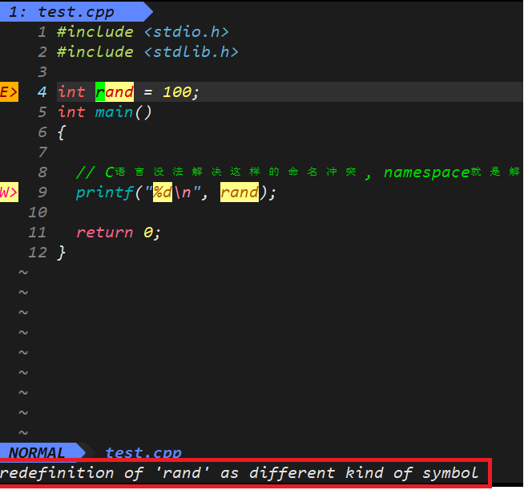
编译器直接提示 `rand` 重定义了, 原来是一个函数, 在 `<stdlib.h>`库函数中.

C语言无法解决命名冲突, 比如我们定义的名称和库里的有冲突, 又比如团队中不同成员的互相之间有命名冲突. 

如果在c语言遇到上面的问题, 是解决不了的, 解决方法只有改名.

而在c++, 提供了 `namespace` 关键字用来解决命名冲突

***
> 命名空间用关键字 `namespace` 定义, 后面跟着命名空间的名字, 然后跟着一对 `{}`, 在 `{}` 里面即命名空间的成员. 

注意: `{}` 后面不需要跟着 `;`

## **正确的命名定义**
```cpp
#include <stdio.h>
#include <stdlib.h>

// 正确的命名定义
namespace wr
{
    int rand = 10;
}

void fun()
{
    printf("%d\n", rand);
}

int main()
{
    fun();
    printf("%d\n", rand);
    return 0;
}
```
程序运行结果如下
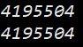

我们发现, 程序并没有得到我们想要的结果.

> 编译器先从局部空间寻找有没有使用这个名字的变量, 如果局部空间没有, 那么就在全局空间来寻找. <font color='red'> 全局空间找不到并不会在命名空间内寻找, 会直接报错 </font>

上述程序就是打印了库中 `rand函数` 的地址, 按整数打印.

*** 
> **一个命名空间就定义了一个新的作用域**, 命名空间中的所有内容都限定在这个作用域内.

下面的程序可以更加直观的观察到, 在命名空间的成员不会被直接当成全局变量的.
```cpp
#include <stdio.h>
#include <stdlib.h>

namespace wr
{
    int rand = 10;
    int x = 1;
}

int main()
{
    printf("%d\n", x);
    return 0;
}
```
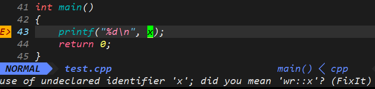
编译器还没有编译就直接报错: `x`未定义

命名定义相当于一堵墙, 将变量围了起来, 我们使用它们需要指定的字符.

***
那么应该怎么样正确使用命名空间的成员呢?

一种方法就是用`::`域作用限定符, 来使用命名空间的成员.

比如我要使用名为`wr`命名空间的成员`rand`, 就需要这样 `wr::rand`(命名空间名 :: 命名空间成员)

```cpp
#include <stdio.h>
#include <stdlib.h>

namespace wr
{
    int rand = 10;
    int x = 1;
}

void fun()
{
    int rand = 100;
    printf("%d\n", wr::rand);
}

int main()
{
    fun();
    printf("%d\n", wr::rand);
    printf("%d\n", wr::x);
    return 0;
}
```
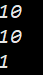
这样就可以正确使用命名空间的成员了, 如果变量名前限定了命名空间, 会直接使用命名空间内的变量, 而不会再在局部空间和全局空间内找.

***
同样, 函数和结构体成员也是可以当作命名空间的成员的, 使用方式也是一样用域作用限定符

```c
#include <stdio.h>
#include <stdlib.h>

namespace wr
{
    int rand = 10;
    
    int Add(int a, int b)
    {
        return a+b;
    }

    struct Node
    {
        int val;
        struct Node* next;
    };
}


int main()
{
    struct wr::Node n1 = {100, NULL};
    
    printf("%d\n", wr::Add(1, 2));
    printf("%d\n", n1.val);
    return 0;
}
```
程序运行结果如下: 
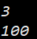

注意域作用限定符是直接作用在名称上的, 例如`struct wr::Node` 而不是`wr::struct Node`

*** 
> 命名空间的好处就是防止发生命名冲突, 即使名称一样通过命名空间可以很好的解决这个冲突

```cpp
#include <stdio.h>
#include <stdlib.h>

namespace wr
{
    int rand = 10;
    
    int Add(int a, int b)
    {
        return a+b;
    }
}

namespace wht
{
    int rand = 100;

    int Add(int a, int b)
    {
        return 10*(a+b);
    }
}

int main()
{
    printf("wr::Add(1, 2):%d\n", wr::Add(1, 2));
    printf("wr::rand:%d\n", wr::rand);

    printf("wht::Add(1, 2):%d\n", wht::Add(1, 2));
    printf("wht::rand:%d\n", wht::rand);
    return 0;
}
```
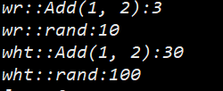

***
> 命名空间是可以嵌套的
```cpp
#include <stdio.h>
#include <stdlib.h>

namespace N1
{
    int a = 10;
    int b = 11;

    int Add (int a, int b)
    {
        return a+b;
    }

    namespace N2
    {
        int c = 12;
        int d = 13;

        int Mul (int a, int b)
        {
            return a*b;
        }
    }
}

int main()
{
    printf("N1::a\t\t%d\n", N1::a);
    printf("N1::b\t\t%d\n", N1::b);
    printf("N1::N2::c\t%d\n", N1::N2::c);
    printf("N1::N2::d\t%d\n", N1::N2::d);
    printf("N1::Add(1,2)\t%d\n", N1::Add(1,2));
    printf("N1::N2::Mul(3,4)\t%d\n", N1::N2::Mul(3,4));

    return 0;
}
```
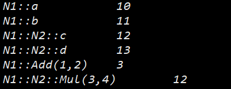

***
> 同一工程允许存在多个相同名称的命名空间, 编译器最后会合成一个命名空间
> 同一文件中的多个相同名称的命名空间, 也会合成一个命名空间

- `Stack.h`
```cpp
#include <stdio.h>
#include <stdlib.h>

namespace wr 
{
  typedef struct Stack
  {
    int* a;
    int capacity;
    int top;
  }ST;

  void StackInit(ST* ps);
  void StackPush(ST* ps, int x);
}
```
- `Stack.cpp`
```cpp
#include "Stack.h"

namespace wr 
{
  void StackInit(ST* ps)
  {
    ps->a = NULL;
    ps->capacity = ps->top = 0;
  }
  
  void StackPush(ST* ps, int x)
  {
    //...
  }
}
```

- `test.cpp`
```cpp
#include "Stack.h"
namespace wr 
{
  int x = 100;
}

int main()
{
  wr::ST s;
  wr::StackInit(&s);

  return 0;
}
```

程序运行没有任何问题, `test.cpp` 使用到了同工程其他文件的同名命名空间的成员.

***
## **命名空间的使用**

还是使用上面栈的数据结构, 如果我想一次性将1,2,3,4,5压入栈, 需要如下操作

```cpp
#include "Stack.h"
namespace wr 
{
  int x = 100;
}

int main()
{
  wr::ST s;
  wr::StackInit(&s);
  wr::StackPush(&s, 1);
  wr::StackPush(&s, 2);
  wr::StackPush(&s, 3);
  wr::StackPush(&s, 4);
  wr::StackPush(&s, 5);

  return 0;
}
```
在每个 `StackPush` 前面都要**加上命名空间和域作用限定符**, 这显然造成代码冗长.

有一种方法可以避免这种情况, **直接使用 `using` 指示**, 将整个命名空间名称引入:
```cpp
#include "Stack.h"
namespace wr 
{
  int x = 100;
}
using namespace wr;

int main()
{
  ST s;
  StackInit(&s);
  StackPush(&s, 1);
  StackPush(&s, 2);
  StackPush(&s, 3);
  StackPush(&s, 4);
  StackPush(&s, 5);

  return 0;
}
```
> `using`指示使得某个特定的命名空间中所有的名字都可见, 这样我们就无需再为它们添加任何前缀限定符了.

> 简写的名字从 `using` 指示开始, 一直到 `using` 指示所在的作用域结束都能使用.


*** 
还有一种最安全的方法, 也就是**使用 `using` 声明**
```cpp
#include <iostream>
using std::cin;

int main()
{
    int i;
    cin >> i;       //正确: cin和std::cin含义相同
    cout << i;      //错误: 没有对应的using声明, 必须使用完整的名字
    std::cout << i; //正确: 显示地从std中使用cout

    return 0;
}
```
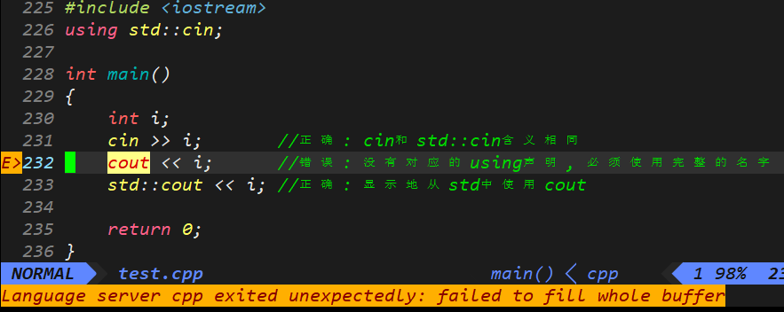
这也是c++特有的输入输出代码, 马上就会讲解这个知识点, 首先中心放在 `using` 声明里.

第232行, 编译器直接提示我没有对应的using声明. 

当然, 我是可以直接用 `using` 指示: `using namespace std`
但是, 库中的命名空间 `std` 显然有很多成员, 如果一次性全部展开, 这是不安全的, **最好最安全的方式就是使用 `using` 声明**. 我需要用到什么成员, 我就声明什么成员.

***
综上: 
> 命名空间的使用有三种方式: 
> - 加命名空间名称及作用域限定符 `::`
> - `using` 声明: 使用`using`将命名空间中某个成员引入
> - `using` 指示: 使用`using namespace 命名空间名称` 引入

注意: **头文件不应包含 `using` 声明**. 如果头文件有某个 `using` 声明, 那么每个使用的该头文件的文件就都会有这个圣经. 对于某些程序来说, 由于不经意间包含了一些名字, 反而可能产生始料未及的名字冲突.

*** 
# 2. c++输入与输出
> c++并未定义任何输入输出(**IO**)语句, 取而代之, 包含了一个全面的**标准库(standard library)** 来提供 **IO**机制(以及很多其他设施)

> `iostream` 库包含两个基础类型 `istream` 和 `ostream`, 分别表示输入流和输出流. 

> 一个流就是一个字符序列, 随着时间的推移, 字符是顺序生成或消耗的.

## 标准输入输出对象
标准库定义了4个 **IO** 对象. 
> `cin` : 标准输入(键盘)
> `cout` : 标准输出(控制台)
> `cerr` : 标准错误
> `clog` : 输出程序运行时的一般性信息
 
实际上 `cin` 和 `cout` 分别是 `istream` 和 `ostream` 类型的对象, 后序会详细讲解

## 向流写入 读取数据
```cpp
#include <iostream>
using std::cout;
using std::cin;
using std::endl;

int main()
{
    int n1, n2;

    cout << "请输入两个数字: " << endl;
    cin >> n1 >> n2;
    cout << n1 << 'x' << n2 << '=' << n1*n2 << endl;

    return 0;
}
```
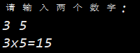

***
**向流写入数据**
```cpp
cout << "请输入两个数字: " << endl;
```
这句表达式使用了**输出运算符(`<<`)**在标准输出上打印信息.

`<<` 接受两个运算对象: 左侧的运算对象必须是一个 `ostream` 对象, 右侧的运算对象是要打印的值.

`endl` 是一个被称为 **操纵符** 的特殊值. 写入 `endl` 的效果是结束当前行, 相当于`\n`.


***
**从流中读取数据**
`cin >> n1 >> n2;`用于读入输入数据

**输入运算符(`>>`)** 与输出运算符类似, 它接受一个 `istream` 作为其左侧运算对象, 接受一个对象为其右侧运算对象. 

***
> 使用c++输入输出更方便, 不需要像 `printf/scanf` 那样, 需要手动输入格式. c++的输入输入可以自动识别格式.

```cpp
#include <iostream>

using namespace std;

int main()
{
    int a;
    double b;
    char c;

    cin >> a >> b >> c;
    cout << a << endl;
    cout << b << endl; 
    cout << c << endl;

    return 0;
}
```

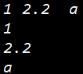

若有打印精度的需求, 可以输入输出流和`printf/scanf`函数结合使用, 当然官方库也提供了一些方法, 如果需要用可以自查.

# 3. 缺省参数
> 缺省参数是**在声明或定义函数时**为函数**参数指定一个缺省值**.

> 在调用该函数时, 如果没有指定实参则使用该形参的缺省值, 否则则使用该实参.

```cpp
void Func(int a = 0)
{
    cout<<a<<endl;
}

int main()
{
    Func();     // 没有传参时，使用参数的默认值
    Func(10);   // 传参时，使用指定的实参

    return 0;
}

```
程序运行如下:
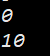

*** 
> 缺省参数让函数调用非常灵活

## 缺省参数分类
- **全缺省参数**
> 函数的所有形参都提供了默认实参

```cpp
void Func(int a = 1, int b = 2, int c = 3)
{
    cout << a << endl;
    cout << b << endl;
    cout << c << endl;
    cout << endl;
}

int main()
{
    Func();
    Func(20);           // a = 20; 
    Func(20, 30);       // a = 20; b = 30;
    Func(20, 30, 40);   // a = 20; b = 30; c = 40;

    return 0;
}
```
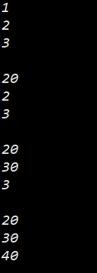

> 若函数有多个形参有默认实参, 如果函数指定了实参, 默认从第一个有默认实参的形参开始指定实参.

> 只能省略尾部的实参, 而不能省略前面的实参.

例如下面的函数调用就是错误的
```cpp
Func(, 20, );
```

***
- **半缺省参数**
> 至少有一个形参没有默认实参 
```cpp
void Func(int a, int b = 2, int c = 3)
{
    cout << a << endl;
    cout << b << endl;
    cout << c << endl;
    cout << endl;
}

int main()
{
    Func();             // err
    Func(20);           // a = 20; 
    Func(20, 30);       // a = 20; b = 30;
    Func(20, 30, 40);   // a = 20; b = 30; c = 40;

    return 0;
}
```

根据我们上面得到的结论
> 拥有半缺省参数的函数, 对于没有默认实参的形参, 都需要在函数调用的时候指定实参. 

> 半缺省参数必须**从右向左依次来给出**, 不能间隔着给

```cpp
void Func(int a = 1, int b, int c);         //err
void Func(int a = 1, int b, int c = 3);     //err
void Func(int a, int b = 2, int c);         //err
void Func(int a, int b, int c = 3);         //正确  
```

总结: <font color='red'>缺省参数后面都应为缺省参数.</font>

> 合理设置形参的顺序, 尽量让不怎么使用默认值的形参出现在前面, 而让哪些经常使用默认值的形参出现在后面.

*** 
## 缺省参数声明
对于函数的声明来说, 通常的习惯是将其放在头文件中, 并且一个函数只声明依次, <font color='red'> 但是多次声明同一个函数也是合法的!</font>

> 不过需要注意的是, **函数的后序声明只能为之前那些没有默认值的形参添加默认实参, 而且该形参的右侧的所有形参必须都有默认值.**

例如已经声明了一个函数:
```cpp
void Func(int a, int b, int c = 3);
```
是不可以在这个声明后面对已经有默认值的形参进行修改默认值的:
```cpp
void Func(int a, int b, int c = 4);     //错误 在上面已经对 c 赋值过默认值, 不可再进行修改
```
同样,如果该形参的右边不全是缺省参数也是不可以的:
```cpp
void Func(int a = 1, int b, int c = 3);   //错误 形参 a 右侧不全是缺省参数
```
下面这样是正确的
```cpp
void Func(int a = 1, int b = 2, int c = 3);
```

> <font color='red'>通常来说, 应该在函数声明中指定缺省参数, 不可在函数声明和函数定义同时指定缺省参数</font>

*** 
## 缺省参数初始值
> 缺省值必须是常量或全局变量.不可以是局部变量

```cpp
int i = 10;
int j = 20;

void Func(int a = i; int b = j; int c = 3)
{
    cout << a << endl;
    cout << b << endl;
    cout << c << endl;
    cout << endl;
}

int main()
{
    Func();         //a = 10; b = 20; c = 3;
    
    i = 100;        //改变了默认实参的值
    int j = 200;    //没有改变默认实参的值
    Func();         //a = 100; b = 20; c = 3;

    return 0;
}
```
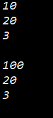
如果缺省参数的缺省值是全局变量, 那么他们的缺省值是在函数调用后才真正开始计算.
这也就是为什么在修改了全部变量后, 形参的默认值也发生了改变.

# 4. 函数重载
自然语言中, 一个词可以有多重含义, 这就是我们所说的二义性. 人们可以根据不同上下语境得到不同的意思, 这个词就被重载了.

## 函数重载概念
> **函数重载**: 同一作用于的几个**函数名字相同**但**形参列表(参数个数 或 类型 或 类型顺序)不同**.

```cpp
int Add(int left, int right)
{
	return left + right;
}

double Add(double left, double right)
{
	return left + right;
}

int main()
{
    cout << Add(1, 2) << endl;
    cout << Add(1.1, 2.2) << endl;

    return 0;
}
```
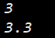
函数接受的形参类型不一样, 但是执行的操作非常类似. 当调用这些函数的时候, 编译器会根据实际传递的实参类型来判断想要的是哪个函数.

*** 
下面的两个函数: 
```cpp
void f()
{
    cout << "f()" << endl; 
}

void f(int a = 1)
{
    cout << "f(int a)" << endl; 
}
```
虽然构成了重载关系, 但是不能实际存在, 对于编译器来说无法判断传入的实参类型, 判断不了程序需要哪个函数.
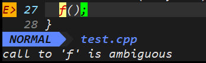

*** 
再次强调一遍, 重载与返回值是否一样无关, 编译器只会检查函数名和形参列表.
像下面的两个函数就会造成重定义:
```cpp
double Add(double left, double right)
{
    return left + right;
}

int Add (double left, double right)
{
    return left + right;
}
```
***

## c++支持函数重载的原理--名字修饰(name Mangling)
在之前学习的关于c语言程序从代码成为一个程序一共经历四个阶段: **预处理 编译 汇编 链接** . 具体移步[c语言:程序环境和预处理](https://blog.csdn.net/Kuzuba/article/details/131898839?spm=1001.2014.3001.5502)

实际项目通常分为多个文件, 这里我创建了两个文件
- `Func.h`
```cpp
#pragma once 
#include <iostream>
using namespace std;

void f(int a, char b);
void f(char a, int b);
```

- `Func.c`
```cpp
#include "Func.h"

void f(int a, char b)
{
    cout << "f(int a, char b)" << endl;
}

void f(char a, int b)
{
    cout << "f(char a, int b)" << endl;
}
```

- `test.cpp`
```cpp
#include "Func.h"

int main()
{
    f(1, 'x');
    f('y', 2);

    return 0;
}
```
*** 
生成可执行程序后, 使用`objdump -S`来查看程序的汇编代码, 观察到在程序中两个重载函数所在的地址不是一样的, 同时所对应的函数名也是不一样的

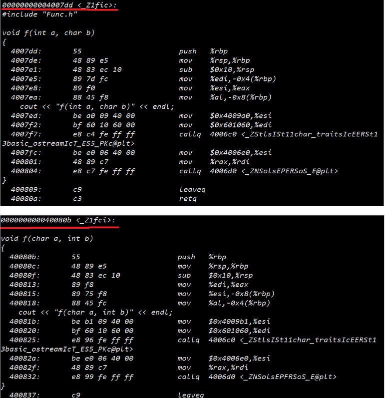

首先在编译阶段就已经将两个函数分别命名, 接着在汇编阶段形成符号表, 最后在链接阶段, 进行符号表中函数的重定位.
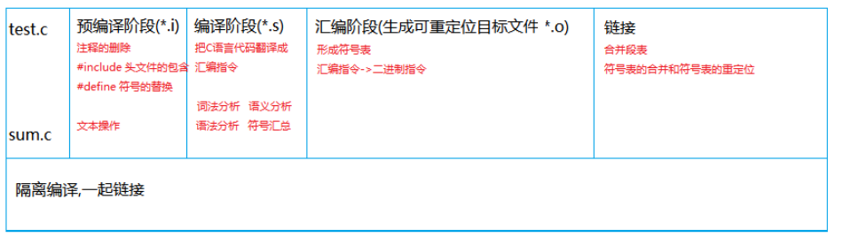

最终, 在主函数呈现出函数重载的效果.
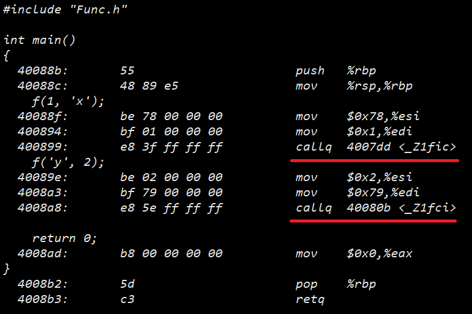

***
在 Linux 中 g++ 编译器的名称修饰规则是这样的: 
`_Z[长度][原始函数名][参数类型]`
例如 
`void f(char a, int b)` 修饰为 `_Z1fci`
`void f(int a, char b)` 修饰为 `_Z1fic`

而在c语言中不会有名称修饰, 所以C语言中不能重载. 
这也是为什么返回值不同不构成重载, 编译器不会将函数的返回值作为要素来命名. 

# 5. 引用
> 引用(reference)不是定义一个新对象, 而是给已存在对象**取了个别名**, 引用类型引用另一种类型. 

> 通常将声明符写成 `&d` 的形式来定义引用类型, 其中 `d` 是声明的变量名

```cpp
int val = 1024;
int &refVal = val;      //refVal 指向 val (是 val 的别名)
int &refVal2;           //报错: 引用必须被初始化

```
一般在初始化变量的时候, 初始值会被拷贝到新建的对象中. 然而定义引用时, 程序**把引用和它的初始值绑定在一起, 而不是将初始值拷贝给引用.** 一旦初始化完成, 引用将永远和它的初始值绑定在一起, 不能将该引用绑定到另一个对象上, 所以**引用必须初始化**.
```cpp
int val1 = 1024;
int val2 = 100;
int &refVal = val1;
&refVal = val2;             //报错: 引用不能被改变
refVal = val2;              //正确, 将val1 的值改为100
```
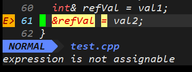

## 引用即别名
> 引用并非对象, 相反的, 它指示为一个已经存在的对象所起的另外一个名字.
```cpp
int main()
{
    int a = 10;  
    int &b = a;     // b是a的别名
    int &c = b;     // c是b的别名, 也是a的别名
    int d = a;      // 将a的值赋给d, 新开辟了一块内存空间

    return 0;
}
```
程序中很明显, a,b,c都是指向同一块空间.而d不是
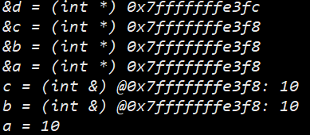

> 注意: <font color='red'> 引用类型必须和应用实体是同一类型的.</font>

## 引用作参数或返回值
### 引用作参数
之前写过指针版本的交换函数
```cpp
void Swap(int* a, int* b)
{
    int tmp = *a;
    *a = *b;
    *b = tmp;
}
```
引用作参数也可以这样写:
```cpp
void Swap(int& a, int& b)
{
    int tmp = a;
    a = b;
    b = tmp;
}
```
> 这样交换的时候更方便, 不用解引用了
***

在学习数据结构的时候, 对于单链表尾插的函数, 有些教科书会这样写:
```cpp
typedef int SLDataType;
typedef struct SListNode
{
    SLDataType val;
    struct SListNode* next;
}SLTNode, *PLTNode;

void SListPushBack(PLTNode& phead, SLDataType x);
```
这里的 `PLTNode& phead` 相当于 `SLTNode*& phead`. 也就是说, 直接将主函数中创建的单链表头结点的引用传过来了. 本来我们需要 `void SListPushBack(SLTNode** phead, SLDataType x);`使用二级指针, 这样就只需要一级指针加引用了, 使之看起来更方便.

> 引用使代码看起来更简洁

### 引用作返回值


