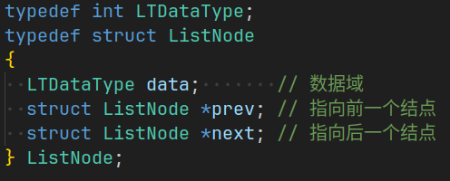
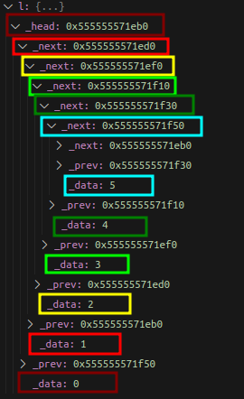

本章是STL容器 `List` 的模拟实现。
之前已经使用 C语言 对**带头双向循环链表** 进行实现，详见[数据结构: 线性表(带头双向循环链表实现)](https://blog.csdn.net/Kuzuba/article/details/132121856), 相较于之前的实现，C++ 下多了对迭代器以及模板等相关语法特性。下面将着重讲解这些新知识。
# 一. `List` 的基本框架
## 1. 结点的结构
n个结点链接成一个链表，首先要构造结点的结构，C语言中结点是这样定义的： 

虽然可以用 `typedef` 使得该结点可以存放不同的数据类型，但是如果在一个程序中有**两个**不同数据类型的链表，就需要再重新创建新的结点结构体，与此同时，链表的相关操作也需要进行重新创建。**这样，一个程序中就有两个近乎相同的一长串代码**，C++ 的模板此时就给了完美的解决方案：
```cpp
// ListNode
template <typename T>
struct ListNode
{
  ListNode<T> *_next; // 指向后继结点的指针
  ListNode<T> *_prev; // 指向前驱结点的指针
  T _data;            // 存放结点的数据
};
```
通过类模板即可以在创建链表的时候指定结点的类型，以此推导出 `T` 的类型。

由于 C++ 中的关键字 `struct` 升级成了一个类, 这样就可以通过**创建结点类的默认构造函数**来实现结点的默认初始化。
STL 中 `List` 是一个带头双向循环链表，那么结点初始化的时候，可以使其的**前驱**和**后继**都指向空指针, 同时**数据域**的初始化调用结点类型的默认构造函数。
```cpp
// ListNode
template <typename T>
struct ListNode
{
  ListNode<T> *_next; // 指向后继结点的指针
  ListNode<T> *_prev; // 指向前驱结点的指针
  T _data;            // 存放结点的数据

  ListNode(const T &val = T()) // 全缺省构造
      : _next(nullptr), _prev(nullptr), _data(val)
  {
  }
};
```

## 2. 链表初始化
设计完结点的结构，接下来就是 `List` 类的构建, 为了方便使用，使用 `typedef` 对 `ListNode<T>` 进行重命名。
`List` 只有一个成员，就是指向头结点即哨兵位的指针。
构造函数也可以写出来了，创建一个新结点，该结点的前驱和后继指向自己，同时 `_head` 的值为该结点的地址。**为了方便拷贝构造以及其他构造函数复用**，这里将这个操作封装成一个私有函数。

```cpp
namespace wr
{
  template <typename T>
  class list
  {
    typedef ListNode<T> Node;

  public:
    list()
    {
      empty_init():
    }

  private:
    void empty_init()
    {
      _head = new Node;
      _head->_prev = _head;
      _head->_next = _head;
    }
    Node* _head;
  };
}
```

## 3. push_back 尾插
此时完成尾插操作的实现，就可以把一个链表的最初框架完成了，尾插的实现就不过多赘述了。
```cpp
push_back(const T &val = T())
{
  Node* newNode = new Node(val);
  Node* tail = _head->_prev;

  // tail newNode _head
  tail->_next = newNode;
  newNode->_prev = tail;
  newNode->_next = _head;
  _head->_prev = newNode;
}
```

这时候通过调试，就可以确认链表创建并尾插成功:  


# 二. 