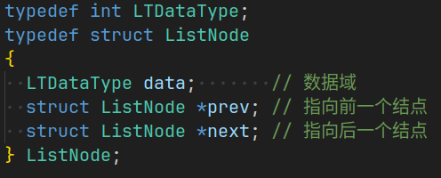
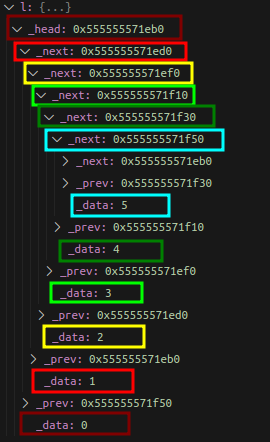
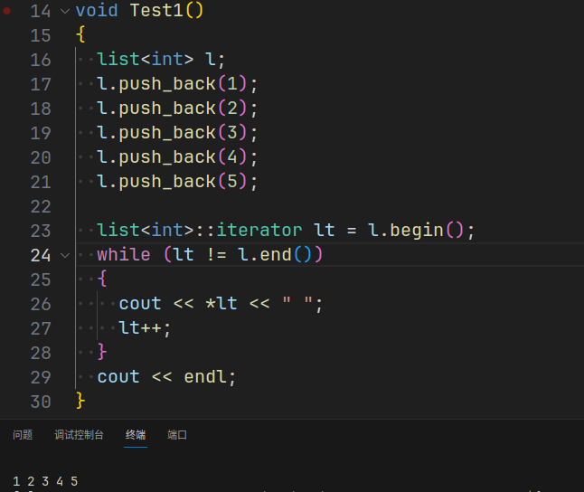

本章是STL容器 `list` 的模拟实现。
之前已经使用 C语言 对**带头双向循环链表** 进行实现，详见[数据结构: 线性表(带头双向循环链表实现)](https://blog.csdn.net/Kuzuba/article/details/132121856), 相较于之前的实现，C++ 下多了对迭代器以及模板等相关语法特性。下面将着重讲解这些新知识。
# 一. list 的基本框架
## 1. 结点的结构
n个结点链接成一个链表，首先要构造结点的结构，C语言中结点是这样定义的： 

虽然可以用 `typedef` 使得该结点可以存放不同的数据类型，但是如果在一个程序中有**两个**不同数据类型的链表，就需要再重新创建新的结点结构体，与此同时，链表的相关操作也需要进行重新创建。**这样，一个程序中就有两个近乎相同的一长串代码**，C++ 的模板此时就给了完美的解决方案：
```cpp
// ListNode
template <typename T>
struct ListNode
{
  ListNode<T> *_next; // 指向后继结点的指针
  ListNode<T> *_prev; // 指向前驱结点的指针
  T _data;            // 存放结点的数据
};
```
通过类模板即可以在创建链表的时候指定结点的类型，以此推导出 `T` 的类型。

由于 C++ 中的关键字 `struct` 升级成了一个类, 这样就可以通过**创建结点类的默认构造函数**来实现结点的默认初始化。
STL 中 `list` 是一个带头双向循环链表，那么结点初始化的时候，可以使其的**前驱**和**后继**都指向空指针, 同时**数据域**的初始化调用结点类型的默认构造函数。
```cpp
// ListNode
template <typename T>
struct ListNode
{
  ListNode<T> *_next; // 指向后继结点的指针
  ListNode<T> *_prev; // 指向前驱结点的指针
  T _data;            // 存放结点的数据

  ListNode(const T &val = T()) // 全缺省构造
      : _next(nullptr), _prev(nullptr), _data(val)
  {
  }
};
```

## 2. 链表初始化
设计完结点的结构，接下来就是 `List` 类的构建, 为了方便使用，使用 `typedef` 对 `ListNode<T>` 进行重命名。
`List` 只有一个成员，就是指向头结点即哨兵位的指针。
构造函数也可以写出来了，创建一个新结点，该结点的前驱和后继指向自己，同时 `_head` 的值为该结点的地址。**为了方便拷贝构造以及其他构造函数复用**，这里将这个操作封装成一个私有函数。

```cpp
namespace wr
{
  template <typename T>
  class list
  {
    typedef ListNode<T> Node;

  public:
    list()
    {
      empty_init():
    }

  private:
    void empty_init()
    {
      _head = new Node;
      _head->_prev = _head;
      _head->_next = _head;
    }
    Node* _head;
  };
}
```

## 3. push_back 尾插
此时完成尾插操作的实现，就可以把一个链表的最初框架完成了，尾插的实现就不过多赘述了。
```cpp
push_back(const T &val = T())
{
  Node* newNode = new Node(val);
  Node* tail = _head->_prev;

  // tail newNode _head
  tail->_next = newNode;
  newNode->_prev = tail;
  newNode->_next = _head;
  _head->_prev = newNode;
}
```

这时候通过调试，就可以确认链表创建并尾插成功:  


# 二. list 迭代器的实现
`list` 的重点就是迭代器的实现。
之前的 `vector` 和 `string` 由于是顺序存储结构，所有迭代器是原生指针，通过 `++` 等操作可以直接访问到对应元素。
但是，`list` 是链式存储结构，在底层各结点的位置不是连续的，**单纯使用原生指针的加减是访问不到结点数据的**。

那么，怎么样才可以通过 `iterator++` 等操作来实现访问结点的效果呢？
<font color=red>得益于C++自定义类型可以进行运算符重载，但`Node*` 是内置类型，不可以进行运算符重载， 可以将`Node*`进行封装，再重载 `++` 等操作</font>

## 1. 迭代器的结构
```cpp
template<class T>
struct __list_iterator{
  typedef ListNode<T> Node; // 重命名
  Node* _node;  // 迭代器指向的结点指针

  // construct
  __list_iterator(Node* node = nullptr)
  : _node(node)
  {}
};
```

## 2. ++,--,*,==,!=
接着是实现 `++,--,*` 操作符的重载
`++` 使迭代器指向当前结点的后驱
`--` 使迭代器指向当前结点的前驱
`*` 得到结点的数据
```cpp
typedef __list_iterator<T> self;  // 重命名
self &operator++()
{
  _node = _node->_next;
  return *this;
}

self operator++(int)
{
  self tmp(*this);
  _node = _node->_next;
  return tmp;
}

self &operator--()
{
  _node = _node->_prev;
  return *this;
}

self operator--(int)
{
  self tmp(*this);
  _node = _node->_prev;
  return tmp;
}

T& operator*()
{
  return _node->_data;
}

bool operator!=(const self &s)
{
  return _node != s._node;
}

bool operator==(const self &s)
{
  return _node == s._node;
}
```

在 `list` 类中添加 `end, begin`
```cpp
typedef __list_iterator<T> iterator;
iterator begin()
{
  return _head->_next;
}
iterator end()
{
  return _head;
}
const_iterator begin() const
{
  return _head->_next;
}
const_iterator end() const
{
  return _head;
}
```

随后进行测试，迭代器构建成功：


## 3. ->
若结点的数据域的类型是自定义类型，例如下面的自定义类型 `AA`
```cpp
struct AA{
  int _a1;
  int _a2;
};
```
当然可以先对迭代器进行**解引用**, 再访问成员：`(*it)._a1`
或者直接使用箭头进行访问： `it->_a1`

这里直接给出 `operator->()`的实现
```cpp
T* operator->()
{
  return &_node->data;
}
```

这样的实现方式会令人感到奇怪，为什么是直接返回结点的数据域地址呢？

这里类似于运算符重载中的`后置++`——将`int`放入参数括号内，也是一种特殊处理。
<font color=red>当出现迭代器后面跟了一个->时，C++语法规定省略了一个->, 实际上为 `it.operator->()->_a1`</font>，这样就可以理解为什么返回的是结点的数据域地址了。

为了实现逻辑自恰，对此进行特殊处理。

## 4. 利用模板实现const迭代器
const迭代器和普通迭代器的区别是**能否对迭代器指向的数据进行修改**，不是直接简单粗暴的 `cosnt iterator` ，迭代器本身是需要改变的。

那么两者有区别的就是 `operator*()` 和 `operator->()` 的返回类型。
普通迭代器是：`T& operator*()`,`T* operator->()`
const迭代器：`const T& operator*()`,`const T* operator->()`

既然两者十分相似，就没有必要在重新创建一个 `__const_list_iterator` 这样的类，导致代码冗余，重复。<font color=red>
模板这个时候又发挥了作用</font>，**可以直接在迭代器的类模板再添加两个类型，在重命名迭代器的时候只要放入对应的类型，让编译器进行类型推演即可**

```cpp
template<class T, class Ref, class Ptr>
class __list_iterator{
  //...
};

template<class T>
class list{
public:
  // 重命名
  typedef __list_iterator<T, T&, T*> iterator;  
  typedef __list_iterator<T, const T&, const T*> const_iterator;
  //...
};
```

# 三. 完整代码
`list` 的其他接口实现就不过多赘述，这里直接贴上模拟实现 `list` 的完整代码
## list.h
```cpp
#ifndef __LIST_H__
#define __LIST_H__
#include <assert.h>

namespace wr
{
  // ListNode
  template <typename T>
  struct ListNode
  {
    ListNode<T> *_next; // 指向后继结点的指针
    ListNode<T> *_prev; // 指向前驱结点的指针
    T _data;            // 存放结点的数据

    ListNode(const T &val = T()) // 全缺省构造
        : _next(nullptr), _prev(nullptr), _data(val)
    {
    }
  };

  // __list_iterator
  template <typename T, typename Ref, typename Ptr>
  struct __list_iterator
  {
    typedef ListNode<T> Node;
    typedef __list_iterator<T, Ref, Ptr> self; // 重命名为self

    Node *_node; // 迭代器指向的结点指针

    __list_iterator(Node *node = nullptr)
        : _node(node)
    {
    }
    __list_iterator(const self &s)
        : _node(s._node)
    {
    }

    self &operator++()
    {
      _node = _node->_next;
      return *this;
    }
    self operator++(int)
    {
      self tmp(*this);
      _node = _node->_next;
      return tmp;
    }
    self &operator--()
    {
      _node = _node->_prev;
      return *this;
    }
    self operator--(int)
    {
      self tmp(*this);
      _node = _node->_prev;
      return tmp;
    }
    Ref operator*()
    {
      return _node->_data;
    }
    Ptr operator->()
    {
      return &(operator*());
    }

    bool operator!=(const self &s)
    {
      return _node != s._node;
    }
    bool operator==(const self &s)
    {
      return _node == s._node;
    }
  };

  // list
  template <typename T>
  class list
  {
    typedef ListNode<T> Node;

  public:
    typedef __list_iterator<T, T &, T *> iterator;
    typedef __list_iterator<T, const T &, const T *> const_iterator;

    list()
    {
      empty_init();
    }
    list(int n, const T &val = T())
    {
      empty_init();
      for (int i = 0; i < n; ++i)
      {
        push_back(val);
      }
    }
    template<typename InputIterator>
    list(InputIterator first, InputIterator last)
    {
      empty_init();
      while (first != last)
      {
        push_back(*first);
        ++first;
      }
    }
    list(const list<T> & l)
    {
      empty_init();
      for (const auto &e : l)
      {
        push_back(e);
      }
    }
    list<T>& operator=(const list<T> l)
    {
      swap(l);
      return *this;
    }
    ~list()
    {
      clear();
      delete _head;
      _head = nullptr;
    }

    ////////////////////////////////////////////////////////////
    // List Iterator
    iterator begin()
    {
      return _head->_next;
    }
    iterator end()
    {
      return _head;
    }
    const_iterator begin() const
    {
      return _head->_next;
    }
    const_iterator end() const
    {
      return _head;
    }
    
    ////////////////////////////////////////////////////////////
    // List Capacity
    size_t size() const
    {
      size_t size = 0;
      const_iterator it = begin();
      while (it != end())
      {
        ++size;
        ++it;
      }
      return size;
    }
    bool empty() const
    {
      return !size();
    }

    ////////////////////////////////////////////////////////////
    // List Access
    T &front()
    {
      return *(begin());
    }
    const T &front() const
    {
      return *(begin());
    }
    T &back()
    {
      return *(--end());
    }
    const T &back() const
    {
      return *(--end());
    }

    ////////////////////////////////////////////////////////////
    // List Modify
    void push_back(const T &val = T())
    {
      // Node *newNode = new Node(val);
      // Node *tail = _head->_prev;

      // tail->_next = newNode;
      // newNode->_prev = tail;
      // newNode->_next = _head;
      // _head->_prev = newNode;
      insert(end(), val);
    }
    void pop_back()
    {
      erase(--end());
    }
    void push_front(const T &val = T())
    {
      insert(begin(), val);
    }
    void pop_front()
    {
      erase(begin());
    }
    iterator insert(iterator pos, const T &val)
    { // 在pos位置前插入值为val的节点
      Node *cur = pos._node;
      Node *prev = cur->_prev;
      Node *newNode = new Node(val);

      prev->_next = newNode;
      newNode->_prev = prev;
      newNode->_next = cur;
      cur->_prev = newNode;

      return newNode;
    }
    iterator erase(iterator pos)
    { // 删除pos位置的节点，返回该节点的下一个位置
      assert(pos != end());

      Node *cur = pos._node;
      Node *prev = cur->_prev;
      Node *next = cur->_next;
      prev->_next = next;
      next->_prev = prev;

      delete cur;

      return next;
    }
    void clear()
    {
      iterator it = begin();
      while (it != end())
      {
        it = erase(it);
      }
    }
    void swap(list<T> &l)
    {
      std::swap(_head, l._head);
    }

  private:
    void empty_init()
    {
      _head = new Node;
      _head->_next = _head;
      _head->_prev = _head;
    }
    Node *_head;
  };
}

#endif // __LIST_H__
```
## test.cpp
```cpp
#include <iostream>
#include <utility>
#include <string>
#include "list.h"

using namespace std;
using namespace wr;

#define SHOW(x)       \
  for (auto e : x)    \
    cout << e << " "; \
  cout << endl;       \

void Test1()
{
  list<int> l;
  l.push_back(1);
  l.push_back(2);
  l.push_back(3);
  l.push_back(4);
  l.push_back(5);

  list<int>::iterator lt = l.begin();
  while (lt != l.end())
  {
    cout << *lt << " ";
    lt++;
  }
  cout << endl;
}

void Test2()
{
  list<int> l;
  l.push_back(1);
  l.push_back(2);
  l.push_back(3);
  l.push_back(4);
  l.push_back(5);
  l.push_back(6);
  SHOW(l);

  l.push_front(0);
  SHOW(l);
  l.pop_back();
  SHOW(l);
  l.pop_front();
  SHOW(l);
  l.clear();
  SHOW(l);
}

void Test3()
{
  list<string> l1;
  l1.push_back("1111");
  l1.push_back("2222");
  l1.push_back("3333");
  l1.push_back("4444");
  l1.push_back("5555");
  l1.push_back("6666");
  SHOW(l1);

  list<string> l2;
  l2.push_back("aaaa");
  l2.push_back("bbbb");
  l2.push_back("cccc");
  l2.push_back("dddd");
  l2.push_back("eeee");
  SHOW(l2);

  l1.swap(l2);
  SHOW(l1);

  l1.front() = "1111";
  l1.back() = "9999";
  cout << l1.front() << endl;
  cout << l1.back() << endl;
  SHOW(l1);
}

void Test4()
{
  list<int> l;
  cout << l.empty() << endl;
  cout << l.size() << endl;

  l.push_back(1);
  l.push_back(1);
  l.push_back(1);
  l.push_back(1);
  l.push_back(1);
  l.push_back(1);
  l.push_back(1);
  cout << l.empty() << endl;
  cout << l.size() << endl;
}

void Test5()
{
  char a[] = "abcdeftg";
  list<char> l1(a, a + sizeof(a) / sizeof(char));
  SHOW(l1);
  cout << l1.size() << endl;

  list<char> l2(l1);
  SHOW(l2);

  list<char> l3;
  l3.push_back('1');
  l2.swap(l3);
  SHOW(l2);
  SHOW(l3);
}

int main()
{
  Test1();
  //Test2();
  //Test3();
  //Test4();
  //Test5();

  return 0;
}
```

本章完。