# 一. `vector` 的介绍
[`vector` 的文档介绍](https://cplusplus.com/reference/vector/vector/)

1. `vector`是表示可变大小数组的序列容器
   `vector` 与C数组的**共同点**是两者底层数据都是顺序存放的，**不同点**是`vector` 的大小可以动态改变，而数组一旦创建初始化后是不可以改变大小的。
2. 既然 `vector` 的底层是连续存储的，那么也可以通过**下标进行访问**，随机访问的时间复杂度是 $O(1)$
3. `vector` 分配空间策略：`vector` 会分配一些额外的空间以适应可能的增长，因此存储空间比实际需要的存储空间更大。不同的库采用不同的策略权衡空间的使用和重新分配。
4. `vector` 就是一个可以更改 `_size` 的数组，和数据结构阶段学习的顺序表是类似的。

# 二. `vector` 的使用
相关接口，参考[文档](https://cplusplus.com/reference/vector/vector/)。
`vector` 的接口相比 `string` 的要简洁许多，抛去了很多冗杂的接口。

## 1. `string` 和 `vector<char>` 的区别

既然 `vector` 可以存放 `char` 类型的元素，那么为什么还会有 `string` 这个类呢？
就比如下面的两个不同类的对象，它们的区别又是什么呢？
```cpp
string s = "helloworld";  
vector<char> v(s.begin(), s.end());
```

***
(1). 两者底层所存放的数据是不一样的
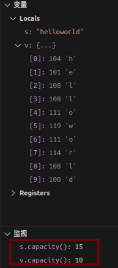

`string` 类对象需要多开辟一块空间用来存放`'\0'`，而 `vector<char>` 则是不需要的，虽然两者的 `size()` 都是 10，但是 `string` 类对象为了存放字符串末尾的 `'\0'`, `capacity()` 已经扩容至了 15.

***
(2). `string` 特有的接口，`vector` 却不会提供
  - `string` 类重载了 `+=` 以便两个字符串进行连接，`vector` 类则没有重载，`vector<int>` 使用 `+=` 没有任何意义
  - 作为字符串，`string` 还提供了很多字符串特有的接口，例如：`substr`, `c_str`。而 `vector` 更重要是顺序存储、动态扩容的容器。

## 2. 为什么 `vector` 没有 `find()` 接口
`vector` 的顺序存储结构的查找效率是 $O(N)$, 这个查找效率不是很高。
实际上，STL 没有提供 `vector` 的 `find()` 接口，相比 `vector`, `map`, `set` 更适合用作查找的容器，`map` 和 `set` 的元素会按照**红黑树**进行存放，红黑树的查找效率是 $O(logN)$。
各容器有各容器的优点，在使用容器的时候，需要根据自己的需求进行选择。

如果真的想对 `vector` 类对象进行查找，C++STL提供了 `<algorithm>` 库，需要用时需要：
```cpp
#include <algorithm>
```
在库中，有一个通用的 `find()` 模板方法：在指定迭代器区间$(first, last]$内查找某一个值 `val`。
**如果找到**，返回指向 `val` 的迭代器；**如果没找到**，返回 `last`
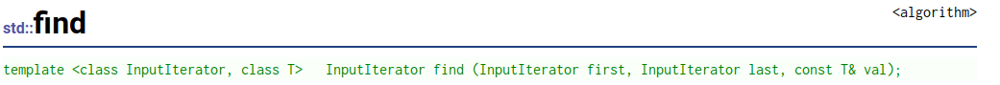

```cpp
int a[] = {0, 1, 2, 3, 4, 5, 6, 7, 8, 9};
vector<int> v(a, a + 10); // 用 int数组 构造 vector<int>对象

vector<int>::iterator ret = find(v.begin(), v.end(), 11); // 使用通用find()方法进行查找

if (ret != v.end())
{
  cout << "找到了" << endl;
}
else
{
  cout << "没找到" << endl;
}
```
程序结果如下：

# 三. `vector` 的模拟实现
模拟实现是为了更好地使用相关接口，而不是真的事无巨细实现成和源码一样。(模拟实现参考 STL3.0源码)
## 1. `vector` 的基本框架
先观察源码框架，主要是从**成员变量、构造函数、插入逻辑**来看。

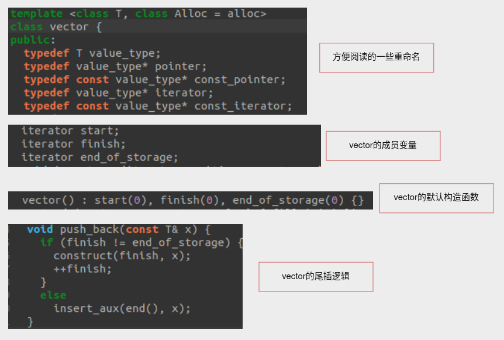

由此可以大致清楚，`vector` 是用三个迭代器进行维护的，迭代器的底层则是指针。
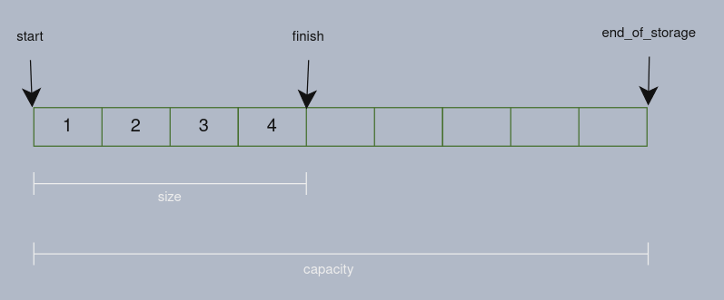

相比使用`_size`，`_a`, `_capacity` 的形式，使用迭代器则更加直接、方便。这样模拟实现 `vector` 的框架就搭好了。

源码的模板参数还有一个`Alloc`, 这是STL六大组件中的空间配置，使用内存池来分配对象空间，再用定位new进行初始化空间，可以减少new的消耗。
在模拟实现可以直接使用new进行开辟空间并初始化。

```cpp
template <typename T>
class vector
{
  public:
    // 重命名迭代器，vector迭代器是原生指针
    typedef T *iterator;  
    typedef const T *const_iterator;

  private:
    iterator _start = nullptr;  // 指向数据块的开始
    iterator _finish = nullptr; // 指向有效数据的尾
    iterator _endofstorage = nullptr; // 指向存储容量的尾
}
```
相关接口如下：
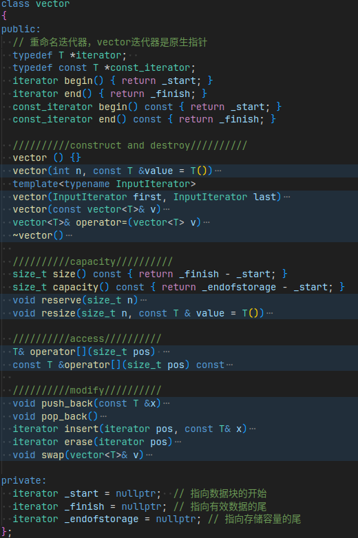

大多数接口逻辑和 `string` 的是一致的，这里就不过多赘述，具体细节在文章结尾会展示出来。
下面主要谈谈在模拟实现中碰到的相关问题。

## 2. `memcpy` 和 `memmove` 的浅拷贝问题
这个问题是在实现 `reserve` 出现的。
```cpp
void reserve(size_t n)
{
  // 只有 n > 当前capacity，才真正会发生扩容
  if (n > capacity())
  {
    size_t old_size = size();
    iterator tmp = new T[n]; 
    if(_start) {
      memcpy(tmp, _start, sizeof(T) * old_size);
      delete[](_start);
    }
    
    _start = tmp;
    _finish = _start + old_size;
    _endofstorage = _start + n;
  }
}
```
上述代码，在 `vector` 元素是**内置类型**或者**浅拷贝自定义类型**不会出现问题，但是元素是**深拷贝内置类型**就会出现问题了。
例如, 下面的代码最终会在销毁 `vstr` 时发生崩溃：
```cpp
vector<int> vi;
vi.push_back(1);
vi.push_back(1);
vi.push_back(1);
vi.push_back(1);
vi.push_back(1);

vector<string> vstr;
vstr.push_back("1111");
vstr.push_back("2222");
vstr.push_back("3333");
vstr.push_back("4444");
vstr.push_back("5555");
```
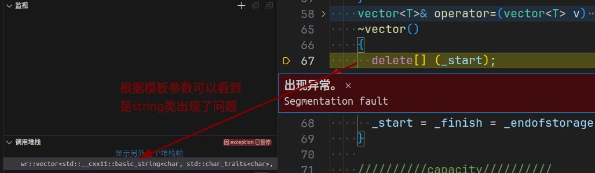

`memcpy` 是内存的二进制格式拷贝，在这里，直接将原来三个迭代器指向的地址原封不动的进行拷贝。

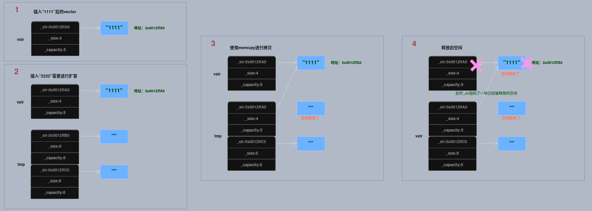
扩容后，此时被拷贝的 `_str` 指向了一块已经释放的空间，同时新开辟的空间也丢失，造成了内存泄漏。
之后，无论是要访问 `_str` 指向的空间，还是要释放 `_str` 指向的空间，程序都会运行崩溃，这是 `memcpy` 仅仅**浅拷贝**造成的。
虽然，**内置类型**和**浅拷贝自定义类型**使用 `memcpy` 不会出现问题，为了容器的泛用性，需要进行修改。

**解决方案**: `new` 后，此时这块空间已经开辟并初始化了，可以直接拷贝构造并赋值。
- 如果 `T` 是内置类型，会直接生成默认值
- 如果 `T` 是自定义类型，会调用深拷贝，不会出现内存泄漏问题。

```cpp
void reserve(size_t n)
{
  // 只有 n > 当前capacity，才真正会发生扩容
  if (n > capacity())
  {
    size_t old_size = size();
    iterator tmp = new T[n]; 

    if(_start) {
      // memcpy(tmp, _start, sizeof(T) * old_size);
      // memcpy 只是浅拷贝，由于已经申请并且初始化该空间，需要另外进行赋值
      for (size_t i = 0; i < old_size; ++i)
      {
        tmp[i] = _start[i];
      }
      delete[] (_start);
    }

    _start = tmp;
    _finish = _start + old_size;
    _endofstorage = _start + n;
  }
}
```

这样程序就不会因为 `memcpy` 的浅拷贝问题而崩溃了。
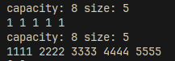

## 3. `vector` 迭代器失效问题
迭代器的主要作用是**让算法能够不用关心底层数据结构**，底层实际上就是一个指针，或者对指针进行了封装。

`vector` 的迭代器就是指针 `T*`, 因此，**迭代器失效，实际上就是迭代器底层对应指针所指向的空间不是原本应该指向的空间**，继续使用失效的迭代器，可能会造成**程序崩溃**。

对于 `vector` 可能会导致其迭代器失效的操作有：
- (1). **会引起底层空间改变的操作，都有可能导致迭代器失效**，例如：`resize,reserve,insert,push_back`等
这些可能会扩容的操作，都有可能造成迭代器失效，扩容后，原来的迭代器仍然指向旧空间，而旧空间已经被释放归还操作系统了，这个时候仍然访问会造成程序崩溃。
```cpp
vector<int> v{1, 2, 3, 4, 5, 6};
auto it = v.begin();  // it指向旧空间
v.reserve(100); // 扩容后旧空间被释放，it并没有指向新空间
while (it != v.end())
{
  cout << *it << " ";
  ++it;
}
cout << endl;

```
在 Linux gcc/g++ 下，程序运行如下：
gcc下，并不会直接停掉程序，没有相应的检查策略。这个程序中，恰好新的空间离原来的旧空间并没有太远，最终会得到下面的结果。
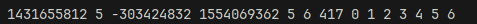

如果在打印前，进行迭代器的更新，就不会出现错误
```cpp
vector<int> v{1, 2, 3, 4, 5, 6};
auto it = v.begin();
v.reserve(100);
it = v.begin(); // 更新
while (it != v.end())
{
  cout << *it << " ";
  ++it;
}
cout << endl;
```
程序运行如下：  

- (2). 指定位置的`erase`操作
  如果想删除 `vector` 中的所有偶数，思路肯定是用迭代器遍历，如果是偶数则删除
```cpp
int a[] = {1, 2, 2, 4, 5, 6, 6, 8, 9};
vector<int> v(a, a + sizeof(a) / sizeof(int));

vector<int>::iterator it = v.begin();
while (it != v.end())
{
  if (*it % 2 == 0)
    v.erase(it);
  ++it;
}

for (auto e: v)
{
  cout << e << " ";
}
cout << endl;
```
结果却是不对的：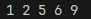

问题关键就是在 `erase` 操作后，此时 `it` 已经指向了下一个元素，但是仍然执行 `++it`, 导致跳过了一个元素。
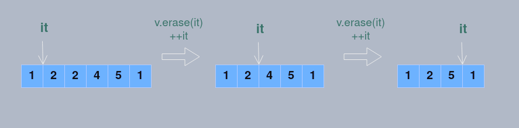
这就是为什么 `insert, erase` 会返回一个迭代器了，返回的是原来的 `pos` 位置的迭代器。

正确程序应该如下：如果有删除操作，重新对 `it` 进行赋值，以保证不会跳过元素
```cpp
int a[] = {1, 2, 2, 4, 5, 6, 6, 8, 9};
vector<int> v(a, a + sizeof(a) / sizeof(int));

vector<int>::iterator it = v.begin();
while (it != v.end())
{
  if (*it % 2 == 0)
  {
    it = v.erase(it);
  }
  else
  {
    ++it;
  }
}

for (auto e: v)
{
  cout << e << " ";
}
cout << endl;
```
程序最终结果正确：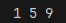

**解决迭代器失效的策略：进行操作后重新对迭代器进行赋值**

## 4. 模拟代码
```cpp
#ifndef __VECTOR_H__
#define __VECTOR_H__

#include <cstring>
#include <assert.h>
#include <utility>

namespace wr
{
  template <typename T>
  class vector
  {
  public:
    // 重命名迭代器，vector迭代器是原生指针
    typedef T *iterator;  
    typedef const T *const_iterator;
    iterator begin() { return _start; }
    iterator end() { return _finish; }
    const_iterator begin() const { return _start; }
    const_iterator end() const { return _finish; }

    //////////construct and destroy//////////
    vector () {}
    vector(int n, const T &value = T())
    {
      assert(n >= 0);

      reserve(n);
      while (_finish != _start + n)
      {
        push_back(value);
      }
    }
    template<typename InputIterator>
    vector(InputIterator first, InputIterator last)
    {
      assert(last >= first);

      reserve(last - first);
      while (first < last)
      {
        push_back(*first);
        ++first;
      }
    }
    vector(const vector<T>& v)
    {
      // reserve(v.capacity());
      // memcpy(_start, v._start, sizeof(T) * v.size());
      // _finish = _start + v.size();

      reserve(v.capacity());
      for (const auto &e :v)
      {
        push_back(e);
      }
    }
    vector<T>& operator=(vector<T> v)
    {
      if (this != &v)
        swap(v);

      return *this;
    }
    ~vector()
    {
      delete[] (_start);
      _start = _finish = _endofstorage = nullptr;
    }
    
    //////////capacity//////////
    size_t size() const { return _finish - _start; }
    size_t capacity() const { return _endofstorage - _start; }
    void reserve(size_t n)
    {
      // 只有 n > 当前capacity，才真正会发生扩容
      if (n > capacity())
      {
        size_t old_size = size();
        iterator tmp = new T[n]; 
        // memcpy(tmp, _start, sizeof(T) * old_size);
        // memcpy 只是浅拷贝，由于已经申请并且初始化该空间，需要另外进行赋值
        if(_start) {
          for (size_t i = 0; i < old_size; ++i)
          {
            tmp[i] = _start[i];
          }
          delete[] (_start);
        }

        _start = tmp;
        _finish = _start + old_size;
        _endofstorage = _start + n;
      }
    }
    void resize(size_t n, const T & value = T())
    {
      assert(n >= 0);

      reserve(n); // 先申请空间，避免下面push_back频繁new消耗内存
      if (n < size()) // 直接改变_finish
      {
        _finish = _start + n;
      }
      else if (n >size())  // 直接尾插
      {
        while (_finish != _start+n)
        {
          push_back(value);
        }
      }
    }

    //////////access//////////
    T& operator[](size_t pos) 
    {
      assert(pos >= 0);
      assert(pos < size());

      return *(_start + pos);
    }
    const T &operator[](size_t pos) const
    {
      assert(pos >= 0);
      assert(pos < size());

      return *(_start + pos);
    }
    
    //////////modify//////////
    void push_back(const T &x)
    {
      // 如果容量不够，先扩容
      if (_finish == _endofstorage)
      {
        reserve(capacity() == 0 ? 4 : 2 * capacity());
      }
      *_finish = x;
      ++_finish;
    }
    void pop_back()
    {
      assert(_finish > _start);

      --_finish;
    }
    iterator insert(iterator pos, const T& x)
    {
      // pos 之前插入数据
      assert(pos >= _start);
      assert(pos <= _finish);

      // 先记录pos相对_start的位置，扩容会更改pos指向元素的位置
      size_t old_pos = pos - _start;
      // 容量不够先扩容
      if (_finish == _endofstorage)
      {
        reserve(capacity() == 0 ? 4 : capacity() * 2);
      }
      
      // 更新pos，移动数据后插入数据
      pos = _start + old_pos;
      // memmove(pos + 1, pos, sizeof(T) * (_finish - pos));
      iterator end = _finish;
      while (end >= pos)
      {
        *(end + 1) = *end;
        --end;
      }
      ++_finish;
      *pos = x;

      return pos;
    }
    iterator erase(iterator pos)
    {
      assert(pos >= _start);
      assert(pos < _finish);

      //memmove(pos, pos + 1, sizeof(T) * (_finish - pos - 1));
      iterator it = pos + 1;
      while (it < _finish)
      {
        *(it - 1) = *it;
        ++it;
      }
      --_finish;

      return pos;
    }
    void swap(vector<T>& v)
    {
      std::swap(_start, v._start);
      std::swap(_finish, v._finish);
      std::swap(_endofstorage, v._endofstorage);
    }

  private:
    iterator _start = nullptr;  // 指向数据块的开始
    iterator _finish = nullptr; // 指向有效数据的尾
    iterator _endofstorage = nullptr; // 指向存储容量的尾
  };
} // namespace wr

#endif // vector.h
```

本章完。