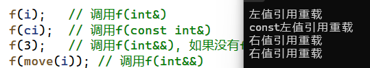
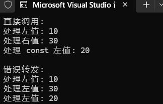

# 右值引用
**右值引用**是C++11后引入的语法特性,C++98就有引用的语法,叫做**左值引用**.无论是左值引用还是右值引用,本质都是给对象取别名.

## 左值和右值
在理解**右值引用**前,先引入左值和右值的概念,左值和右值都是一个表示数据的表达式.

**左值**(locator value,lvalue):一般有持久状态,存储在内存中,可以对其取地址即在前放置`&`符号.左值可以出现在赋值符号`=`的左右.经过`const`修饰后的左值虽然不可以进行赋值,但是**可以取它的地址**.

```cpp
// 左值:可以地址
// 以下的pb、c、*p、s[0]就是常见的值
int* p = newint(0);
int b = 1;
const int c =b;
*p = 10;
string ("111111");
s[0] = 'x';
```

**右值**(read value, rvalue):字面值常量(1, 'c'等),表达式求值过程中创建的临时对象等,右值只可以出现在赋值符号的右边,**不可以取地址**.

```cpp
// 右值:不能地址
double x = 11, y = 2.2;
// 以下的10、x + y、fmin(x, y)、string("11111")都常见的右值
10;
x + y;
fmin(x, y);
strin("11111");

// error:表式必须是左值函数指示符
// cout << 10 << endl;
// cout << &(+y) << endl;
// cout << (fmin(x, y))<< endl;
// cout << strin("11111") <<endl;
```

<font color=red>总结</font>:左值和右值的核心区别就是**能否取地址**.

## 左值引用和右值引用
`Type& r1 = x; Type&& rr1 = y;`
第一个语句是**左值引用**,左值引用是给左值取别名;第二个语句是**右值引用**,右值引用是给右值取别名.

对于上述的`pb、c、*p、s、s[0]`,都可以进行左值引用.
```cpp
// 左值引⽤给值取别名
int& r1 = b;
int*& r2 = p;
int& r3 = *p;
string& r4 =s;
char& r5 = [0];
```

对于上述的`10、x + y、fmin(x, y)、string("11111")`,都可以进行右值引用

```cpp
 // 右值引用给右值取别名
 int&& rr1 = 10;
 double&& rr2 = x + y;
 double&& rr3 = fmin(x, y);
 string&& rr4 = string("11111");
```

左值引用不能直接引用右值,但是`const`左值引用可以引用右值;右值引用不能直接引用左值,但是右值引用可以引用move(左值).
(move是库里面的⼀个函数模板，本质内部是进行强制类型转换).

```cpp
// 左值引用不直接引用右值,但是const左引用可以引用值
const int&rx1 = 10;
const double&rx2 = x + y;
const double&rx3 = fmin(x,y);
const string&rx4 = strin("11111");

// 右值引用不直接引用左值,是右值引用可引用move(左值)
int&& rrx1 =move(b);
int*&& rrx2 =move(p);
int&& rrx3 =move(*p);
string&& rrx4= move(s);
string&& rrx5= (string&&)s;
```
需要<font color = red>注意</font>的是变量表达式都是**左值属性**，也就意味着一个右值被右值引用绑定后，右值引用变量变量表达式的属性是左值.

```cpp
// b、r1、rr1都是变量表达式都是左值,都可取地址
cout << &b <<endl;
cout << &r1<< endl;
cout << &rr1<< endl;
```

右值引用不能再被右值引用绑定,除非move一下.
```cpp
int& r6 = r1;
// int&& rrx6= rr1; error
int&& rrx6 =move(rr1);
```
右值引⽤可⽤于为临时对象延⻓⽣命周期，const的左值引⽤也能延⻓临时对象⽣存期，但这些对象⽆法被修改。

## 左值和右值的参数匹配
C++98中,`const`左值引用作为参数的函数,实参传递左值和右值都可以匹配.
|形参|引用|`const`引用|
|---|---|---|
|实参|左值|`const`左值,右值|右值|

C++11中,对于实参形参匹配进行再细分
|形参|左值引用|`const`左值引用|右值引用|
|---|---|---|---|
|实参|左值|`const`左值|右值|

下面的程序中,对`f`进行重载,观察实参匹配情况

```cpp
void f(int& x)
{
    cout << "左值引用重载" << endl;
}

void f(const int& x)
{
    cout << "const左值引用重载" << endl;
}

void f(int&& x)
{
    cout << "右值引用重载" << endl;
}

int main()
{
    int i = 1;
    const int ci = 2;

    f(i);   // 调用f(int&)
    f(ci);  // 调用f(const int&)
    f(3);   // 调用f(int&&), 如果没有f(int&&)重载则会调用f(const int&)
    f(move(i)); // 调用f(int&&)
}
```
程序运行结果如下:



需要<font color=red>注意</font>的是:右值引用变量,在用于表达式时是左值
```cpp
int&& x = 1;
f(x);       // 调用f(int&)
f(move(x)); // 调用f(int&&)
```

## 引用的使用场景

### 左值引用的使用场景
```cpp
int a = 1;
int& b = a;
```
上述`a`为左值,可以左值引用,`b`和`a`共享一份资源.

> 左值引用主要使用场景实在**函数中左值引用传参和左值引用传返回值时减少拷贝, 同时还能修改实参和修改返回对象的值**.

例如类与对象的拷贝构造中,可以利用**左值引用传参和左值引用传返回值**来减少拷贝.

```cpp
class Myclass {
public:
    Myclass(int data = 10) : _data(data)
    {
        cout << "默认构造Myclass(int data = 10)" << endl;
    }

    Myclass(const Myclass& tmp) : _data(tmp._data)
    {
        cout << "拷贝构造Myclass(const Myclass& tmp)" << endl;
    }

    Myclass Add(int val)
    {
        _data += val;
        return *this;
    }
private:
    int _data;
};

int main()
{
    Myclass m1;
    Myclass m2(m1.Add(10));
}
```
对于上述程序,`Myclass`拥有默认构造函数,拷贝构造函数和`Add`成员函数.

`Add`中的返回值是对`Myclass`对象的传值返回,这意味着当调用`Add`函数时,在返回时会先拷贝构造一份和`*this`一样的副本,再将副本进行返回.

创建`m1`时会调用一次默认构造,随后调用`Add`会进行一次拷贝构造,创建`m2`会进行第二次拷贝构造.

有些编译器会进行优化,将两次拷贝构造优化为一次,这里对`g++`添加编译参数`-fno-elide-constructors`进行编译.

程序运行结果如下:
```bash
root:~/learning# ./test 
默认构造Myclass(int data = 10)
拷贝构造Myclass(const Myclass& tmp)
拷贝构造Myclass(const Myclass& tmp)
```

将`Add`修改为传左值引用返回,则会减少一次拷贝构造
```cpp
Myclass& Add(intval)
{
    _data += val;
    return *this;
}
```
程序运行结果如下:
```bash
root:~/learning# ./test 
默认构造Myclass(int data = 10)
拷贝构造Myclass(const Myclass& tmp)
```

需要<font color=red>注意</font>的是:左值引用传返回值不可以将局部对象作为返回值,当返回时,局部对象已被销毁,造成悬空引用.

### 右值引用的使用场景
> 右值引用:用 `&&` 声明的引用,它只能绑定到右值上.它的核心价值在于**延长临时对象的生命周期**,并允许"窃取"其资源.

由于左值引用会造成悬空引用的情况,所以局部变量不可以进行左值引用返回.如果返回的是一个占用内存很大的对象,由于只能先拷贝一份再将这份副本进行返回,传值返回开销会巨大.

```cpp
class Solution {
public:
    // 这里的传值返回拷贝代价就太大了
    vector<vector<int>> generate(int numRows) {
    vector<vector<int>> vv(numRows);
    for (int i = 0; i < numRows; ++i)
    {
        vv[i].resize(i + 1, 1);
    }
    for (int i = 2; i < numRows; ++i)
    {
        for (int j = 1; j < i; ++j)
        {
            vv[i][j] = vv[i - 1][j] + vv[i - 1][j - 1];
        }
    }
    return vv;
    }
};
```
很清楚,这里的`vv`马上就要被销毁,与其进行昂贵的深拷贝,不知直接将其内部的资源"偷"过来,然后将源对象置于一个可安全析构的状态.

右值引用主要用于**移动语义,完美转发和标准库优化**.

#### 移动语义
移动构造函数和移动赋值运算符
> * **移动构造函数**是一种构造函数,类似于拷贝构造函数,移动构造函数要求第一个参数时该类类型的引用,但是不同的是要求这个参数是右值引用,如果还有其他参数,额外参数必须有缺省值.
> * **移动赋值运算符**是一个赋值运算符的重载,他跟拷贝赋值构成函数重载,类似于拷贝赋值函数,移动赋值函数要求第一个参数是该类类型的引用,但是不同的是要求这个参数是右值引用.

对于`string\vector`这样深拷贝的类或者包含深拷贝成员变量的类,**移动构造和移动赋值**才有意义.

由于`STL`中已将`string`封装好,下面自行创建一个简单的`string`类.

```cpp
class MyString {
private:
    char* _data;
    size_t _size;
public:
    // 默认构造函数
    MyString(const char* str = "")
        :_size(strlen(str))
    {
        _data = new char[_size + 1];
        std::memcpy(_data, str, _size + 1);
        cout << "默认构造函数MyString(const char* str = "")" << endl;


    // 传统的拷贝构造函数(深拷贝,成本高)
    MyString(const MyString& other) : _size(other._size)
    {
        _data = new char[_size + 1];
        std::memcpy(_data, other._data, _size + 1);
        cout << "拷贝构造函数MyString(const MyString& other)" << endl;
    }

    // 移动构造函数("窃取"资源,成本极低)
    MyString(MyString&& other) noexcept
        :_data(other._data), _size(other._size)
    {
        // 直接复制指针和大小

        // 将源对象置于可安全析构的状态
        other._data = nullptr;
        other._size = 0;
        std::cout << "移动构造函数MyString(MyString&& other)" << std::endl;
    }
};
```
`MyString`类中有**默认构造函数,拷贝构造函数,移动构造函数**.
在移动构造函数中,直接将`other._data`赋值给`_data`,仅修改指针,指针指向数据没有进行深拷贝,开销降低.

下面的使用场景,可以探知通过**右值引用**触发移动语义的优势.
```cpp
// 使用场景
MyString createString() {
    MyString temp("Hello");
    return temp; // 这里编译器通常会进行RVO，但即使不优化，也会优先选择移动构造函数
}

int main()
{
    MyString s1 = createString(); // 如果没有移动构造，这里会调用拷贝构造。有移动构造则调用移动构造。
    MyString s2 = std::move(s1);  // 使用 std::move 将左值 s1 强制转换为右值，触发移动构造
}
```
构建`s1`时,首先调用默认构造创建`temp`临时对象.

`createString`返回时若没有移动构造,会调用拷贝构造.有移动构造则调用了移动构造.由于关闭了编译器优化,编译器不会进行RVO,这里会进行两次移动构造.
第一次:`temp->返回值`
第二次:`返回值->s1`

构建`s2`时,通过`move`将左值`s1`强制转换为右值,触发第三次移动构造.

程序运行如下:
```bash
root:~/learning# ./test 
默认构造函数MyString(const char* str = )
移动构造函数MyString(MyString&& other)
移动构造函数MyString(MyString&& other)
移动构造函数MyString(MyString&& other)
```

通过移动赋值同样会进行优化,这里只放置移动赋值的实现,为简化代码,令移动构造和移动赋值都调用`swap`成员函数.

```cpp
void swap(MyString& s)
{
    ::swap(_data, s._data);
    ::swap(_size, s._size);
}g
// 移动构造
MyString(MyString&& other)noexcept
{
    swap(other);
    other._data = nullptr;
    other._size = 0;
    std::cout << "移动构造函数MyString(MyString&& other)"<< std::endl;
}
// 移动赋值
MyString& operator(MyString&& other)
{
    if (this != &other)
    {
        swap(other);
        other._data = nullptr;
        other._size = 0;
        std::cout << "移动赋值MyString&operator(MyString&&other)" <<std::endl;
    }
    return *this;
}
```

下列三个场景会自动触发移动语义
* 函数返回一个局部对象时(配合RVO)
* 使用`std::move`显示转换
* 使用临时对象进行构造或赋值

#### 完美转发
> 完美转发指的是：在模板函数中将参数原封不动地传递给另一个函数，
> 包括：
> * **值类别**（左值/右值）
> * **`const/volatile` 限定符**
> * **引用类型**

完美转发的技术基础是引用折叠,先详细讲解一下**引用折叠**.

##### 引用折叠
> **引用折叠**是 C++11 引入的规则，用于处理在模板推导和类型别名中出现的多重引用情况。当编译器遇到两个引用相邻时，它会按照特定规则将它们"折叠"成单个引用。

C++中不能直接定义引用的引用如`int& && r = i`,这样会直接报错,通过模板或`typedef`中的类型操作可以构成引用的引用.

通过模板或`typedef`中的类型操作可以构成引用的引用时,这时C++11给出了一个引用折叠的规则.

第一个引用|第二个引用|折叠结果|
---|---|---|
&|&|&|
&|&&|&|
&&|&|&|
&&|&&|&&|

核心为:**右值引用的右值引用折叠成右值引用,所有其他组合均折叠成左值引用**.

通过`typedef`构成引用折叠:
```cpp
typedef int& lref;
typedef int&& rref;
int n = 0;
lref& r1 = n;   //r1 的类型是 int&
lref&& r2 = n;  //r2 的类型是 int&
rref& r3 = n;   //r3 的类型是 int&
rref&& r4 = 1;  //r4 的类型是 int&&
```
通过模板构成**引用折叠**:

```cpp
// 由于引用折叠限定,f1实例化以后总是左值引用
template<class T>
void f1(T& x)
{ }

// 由于引用折叠限定,f2实例化以后可以是左值引用,也可以是右值引用
template<class T>
void f2(T&& x)
{ }
```

下面通过传入不同参数以及不同模板类型,感知引用折叠.
```cpp
// 没有折叠->实例化void f1(int& x)
f1<int>(n); 
f1<int>(0);     //报错

// 折叠->实例化void f1(int& x)
f1<int&>(n);
f1<int&>(0);    //报错

// 折叠->实例化void f1(int& x)
f1<int&&>(n);
f1<int&&>(0);   //报错

// 折叠->实例化void f1(const int&x)
f1<const int&>(n);
f1<const int&>(0);  

// 折叠->实例化void f1(const int&x)
f1<const int&&>(n);
f1<const int&&>(0);

// 没有折叠->实例化void f2(int&& x)
f2<int>(n);     //报错
f2<int>(0);

// 折叠->实例化void f2(int& x)
f2<int&>(n);
f2<int&>(0);   // 报错

// 折叠->实例化void f2(int&& x)
f2<int&&>(n);   //报错
f2<int&&>(0);   
```

下面通过一个程序来手动模拟推导过程:
```cpp
// 手动模拟模板推导和引用折叠
template<class T>
struct myClass {
    using Type = T&&;   // 这里会发生引用折叠
};

int main()
{
    int val = 42;

    // int&
    using Result1 = myClass<int&>::Type;    // int& && -> int&

    // int&&
    using Result2 = myClass<int&&>::Type;   // int&& && -> int&&

    // const int&
    using Result3 = myClass<const int&>::Type;  // const int& && -> const int &

    return 0;
}
```

由此引出完美转发的核心:**万能引用**.

> **万能引用**是一种特殊的引用类型，它能够同时绑定到左值和右值。这不是一个新的引用类型，而是模板推导和引用折叠共同创造的效果。

基本语法:
```cpp
template<typename T>
void function(T&& param) {  // 这里的 T&& 是万能引用！
    // ...
}
```
<font color=red>`T&&`在模板参数推导的语境下才是万能引用</font>.

##### 通过引用折叠和万能引用实现完美转发

`f(T&& t)`函数模板程序中,传左值实例化以后是左值引用的`f`函数,传右值实例化以后是右值引用的`f`函数.

但是,由于**变量表达式都是左值属性**,也就意味着一个右值被右值引用绑定后,右值引用变量表达式的属性是左值,当把`t`传递给下一层函数`Fun`时,那么匹配的全是左值引用版本的`Fun`函数.

下面的程序展示了**转发丢失值类别**的问题场景:
```cpp
// 目标函数 - 重载版本
void process(int& x) {
    cout << "处理左值: " << x << endl;
}

void process(int&& x) {
    cout << "处理右值: " << x << endl;
}

void process(const int& x) {
    cout << "处理 const 左值: " << x << endl;
}

// 简单的转发函数 - 有问题！
template<class T>
void forward_bad(T arg) {       // 按值传递,总是拷贝
    process(arg);               // arg 总是左值！
}

template<typename T>
void forward_bad2(T& arg) {    // 只能接受非const左值
    process(arg);              // 总是调用左值版本
}

int main() {
    int x = 10;
    const int y = 20;

    cout << "直接调用:" << endl;
    process(x);        // 左值版本 ✓
    process(30);       // 右值版本 ✓
    process(y);        // const左值版本 ✓

    cout << "\n错误转发:" << endl;
    forward_bad(x);    // 左值版本 ✓ (但有不必要的拷贝)
    forward_bad(30);   // 左值版本 ✗ (应该是右值！)
    forward_bad(y);    // 左值版本 ✗ (应该是const左值！)

    // forward_bad2(30);  // 编译错误！不能绑定右值到非const左值引用
}
```

程序运行如下:


要想保持传入对象的属性,就需要**完美转发**实现.

要实现**完美转发**,需要三个技术组合
* 万能引用
* 引用折叠
* `std::forward`转发函数

下面是`std::forward`的简化实现
```cpp
// 左值引用版本
template<typename T>
constexpr T&& forward(typename std::remove_reference<T>::type& arg) noexcept {
    return static_cast<T&&>(arg);  // 引用折叠发生在这里
}

// 右值引用版本  
template<typename T>
constexpr T&& forward(typename std::remove_reference<T>::type&& arg) noexcept {
    return static_cast<T&&>(arg);
}
```

下面实例中是**完美转发**的正确应用,通过创建调试工具来观察整个过程:
```cpp
#include <iostream>
#include <utility>

using namespace std;

// 调试工具
template<class T>
void debug_forward(const char* scenario, T&& arg) {
    cout << scenario << ":" << endl;

    if (is_lvalue_reference<T>::value) {
        cout << "  T 是左值引用" << endl;
    }
    else if (is_rvalue_reference<T>::value) {
        cout << "  T 是右值引用" << endl;
    }
    else {
        cout << "  T 是非引用类型" << endl;
    }

    cout << "  转发前 arg 是: ";
    if (is_lvalue_reference<decltype(arg)>::value) cout << "左值引用" << endl;
    else if (is_rvalue_reference<decltype(arg)>::value) cout << "右值引用" << endl;

    cout << "  转发后结果是: ";
    if (is_lvalue_reference<decltype(std::forward<T>(arg))>::value)
        cout << "左值引用" << endl;
    else if (is_rvalue_reference<decltype(std::forward<T>(arg))>::value)
        cout << "右值引用" << endl;

    cout << endl;
}

// 目标函数
void target(int&) { cout << "  调用: 左值版本" << endl; }
void target(int&&) { cout << "  调用: 右值版本" << endl; }
void target(const int&) { cout << "  调用: const左值版本" << endl; }

// 完美转发函数
template<class T>
void perfect_forward(T&& arg){
    debug_forward("在 perfect_forward 中", arg);
    target(std::forward<T>(arg));
}

int main() {
    int x = 10;
    const int y = 20;

    cout << "=== 完美转发演示 ===" << endl;
    perfect_forward(x);             // 左值
    perfect_forward(30);            // 右值
    perfect_forward(y);             // const 左值
    perfect_forward(std::move(x));  // 右值

    return 0;
}
```

程序运行如下:
```bash
root@:~/learning# ./test 
=== 完美转发演示 ===
在 perfect_forward 中:
  T 是左值引用
  转发前 arg 是: 左值引用
  转发后结果是: 左值引用

  调用: 左值版本
在 perfect_forward 中:
  T 是左值引用
  转发前 arg 是: 左值引用
  转发后结果是: 左值引用

  调用: 右值版本
在 perfect_forward 中:
  T 是左值引用
  转发前 arg 是: 左值引用
  转发后结果是: 左值引用

  调用: const左值版本
在 perfect_forward 中:
  T 是左值引用
  转发前 arg 是: 左值引用
  转发后结果是: 左值引用

  调用: 右值版本
```

完美转发需要注意的是:
* 避免在转发前使用参数
```cpp
template<typename T>
void bad_forward(T&& arg) {
    cout << arg << endl;        // 使用了 arg
    process(std::forward<T>(arg));  // 可能已经改变了状态！
}

// 正确做法：如果需要使用，先拷贝
template<typename T>
void good_forward(T&& arg) {
    auto copy = arg;           // 创建副本
    cout << copy << endl;      // 使用副本
    process(std::forward<T>(arg));  // 原样转发
}
```
* 避免多次转发
```cpp
template<typename T>
void double_forward(T&& arg) {
    // 错误！多次转发同一个参数
    process1(std::forward<T>(arg));
    process2(std::forward<T>(arg));  // arg 可能已经被移动！
}
```
* 避免万能引用构造函数
```cpp
class Widget {
public:
    template<typename T>
    Widget(T&& name) : name(std::forward<T>(name)) {}  // 小心！
    
    // 这个会"劫持"拷贝构造！
    // 需要 SFINAE 或 C++20 概念来约束
private:
    string name;
};
```
