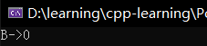
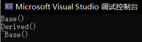
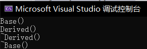
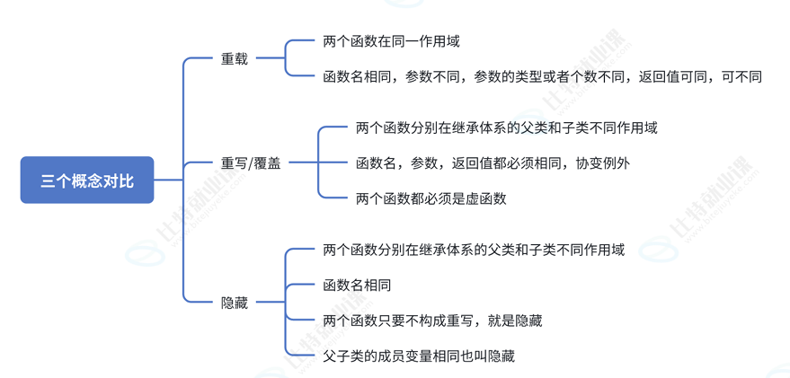
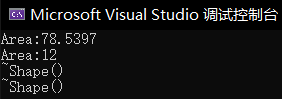

# 一、多态的概念

> 多态(ploymorphism)：通俗来说，就是多种形态。

**多态**分为编译时多态（静态多态）和运行时多态（动态多态）。

- **编译时多态**主要是**函数重载**和**函数模板**，通过传达不同的参数，以做到同一个函数名表达不同形态，由于将实参传递给形参的参数匹配是在编译时完成的，所以叫做编译时多态。
- **运行时多态**，具体点就是去完成某个行为（函数），可以传不同的对象就会完成不同的行为，由此达到多种形态。譬如买票这个行为，普通人是全价买票，学生是优惠买票，军人则是优先买票。

# 二、多态的定义及实现
> 多态是在不同继承关系的类对象，去调用同一函数，产生了不同的行为。

针对上面买票的例子，创建三个类，`Student`和`Soldier`继承自`Person`：

```cpp
class Person {};
class Student : public Person {};
class Soldier : public Person {};
```
对于买票这个行为，创建函数`BuyTicket`
```cpp
void BuyTicket();
```

为了实现多态，需要先将基类的`BuyTicket`通过`virtual`关键字定义成**虚函数**（非成员函数不能加`virtual`进行修饰）。

在重写基类虚函数时，派⽣类的虚函数在不加`virtual`关键字时，虽然也可以构成重写(因为继承后基类的虚函数被继承下来了在派⽣类依旧保持虚函数属性)，但是该种写法不是很规范，不建议这样使⽤。基类虚函数必须要加`virtual`修饰。

同时派生类的`BuyTicket`做到**返回值类型、函数名字、参数列表完全相同**，达到**重写**的效果：
```cpp
class Person {
public:
    // 添加virtual关键字
    virtual void BuyTicket()
    {
        cout << "全价买票" << endl;
    }
};
class Student : public Person {
public:
    // 派生类保持返回值类型，函数名及参数列表完全相同，才可以达到重写
    virtual void BuyTicket()
    {
        cout << "半价买票" << endl;
    }
};
class Soldier : public Person {
public:
    virtual void BuyTicket()
    {
        cout << "优先买票" << endl;
    }
};
```
自此，完成继承中构成多态的一个条件：**被调用的函数必须是虚函数，并且派生类必须对基类的虚函数进行重写。**

> 重写也称覆盖，是派生类对基类允许访问的方法的**实现过程**进行重新改写，返回值类型、函数名称及参数列表都不能改变。

接着设计一个`Pay`函数，通过接收不同的身份来调用不同的`BuyTicket`函数，调用虚函数需要用到**指针**或**引用**：
```cpp
// 调用虚函数必须通过指针或引用
void Pay(Person* ptr)
{
    // 虽然都是Person指针ptr在调用BuyTicket
    // 但是跟ptr没关系，而是由ptr指向的对象决定的
    ptr->BuyTicket();
}
```
这是构成**多态**的第二个条件：必须通过**基类的指针**或**引用**调用**基函数**。

下面的程序展示了如何实现**多态**：
```cpp
class Person {
public:
    // 添加virtual关键字
    virtual void BuyTicket()
    {
        cout << "全价买票" << endl;
    }
};
class Student : public Person {
public:
    // 派生类保持返回值类型，函数名及参数列表完全相同，才可以达到重写
    virtual void BuyTicket()
    {
        cout << "半价买票" << endl;
    }
};
class Soldier : public Person {
public:
    virtual void BuyTicket()
    {
        cout << "优先买票" << endl;
    }
};

// 调用虚函数必须通过指针或引用
void Pay(Person* ptr)
{
    ptr->BuyTicket();
}

int main()
{
    Person p;
    Student st;
    Soldier so;

    Pay(&p);
    Pay(&st);
    Pay(&so);

    return 0;
}
```
程序运行结果如下：


## 多态构成的条件
**继承**中要构成**多态**必须要两个条件：


- 必须通过**基类的指针或者引用调用虚函数**。

- 被调用的函数必须是**虚函数**，并且派生类必须对基类的虚函数进行**重写**。

对象不可以调用虚函数，并且只有基类指针才可以既指向基类对象又指向派生类对象。

## 虚函数重写的问题
### 默认参数与虚函数
对于下面一个程序，最终输出结果是什么（）
**A**: A->0 **B**:B->1 **C**:A->1 **D**:B->0 **E**:编译出错 **F**:以上都不正确
```cpp
class A
{
public:
    virtual void func(int val = 1) { std::cout << "A->" << val << std::endl; }
    virtual void test() { func(); }
};

class B : public A
{
public:
    void func(int val = 0) { std::cout << "B->" << val << std::endl; }
};

int main(int argc, char* argv[])
{
    B* p = new B; 
    p->test();
    return 0;
}
```

开始分析，`p`是派生类指针，随后调用`test`，由于继承关系中对成员函数的搜索是先派生类再基类。`B`中没有`test`，调用`A`中的`test`，此时`*this == B`，`B`中已经将`func`进行重写覆盖，**由于构成多态时只重写实现，函数体不变**，此时传入`func`的`val`值为1，`test`是`A`中的函数，调用`func`时，默认参数是静态绑定的，函数实现继续实行重写内容，最终输出内容为`B->1`。

若是直接`p->func()`呢？
答案是`B->0`，这里的关键是**默认参数的值是在编译时根据调用该函数的指针或引用的静态类型来确定的，而虚函数是动态绑定的**。`test`是`A`中成员函数，其中`func`在编译时的参数是静态决定的，为1。

### 协变
派⽣类重写基类虚函数时，与基类虚函数返回值类型不同。即基类虚函数返回基类对象的指针或者引⽤，派⽣类虚函数返回派⽣类对象的指针或者引⽤时，称为协变。协变的实际意义并不⼤，了解⼀下即可。

```cpp
class A {};
class B : public A {};
class Person {
public:
    virtual A* BuyTicket()
    {
        cout << "买票全价" << endl;
        return nullptr;
    }
};
class Student : public Person {
public:
    virtual B* BuyTicket()
    {
        cout << "买票打折" << endl;
        return nullptr;
    }
};
```

### 析构函数的重写
基类的虚构函数需要声明为虚函数，否则会出现如下错误。
下面一段程序：
```cpp
class Base {
public:
    Base() { cout << "Base()" << endl; }
    ~Base() { cout << "~Base()" << endl; }
};

class Derived : public Base {
public:
    Derived() { cout << "Derived()" << endl; }
    ~Derived() { cout << "~Derived()" << endl; }
};

int main()
{
    Base* p = new Derived();    // 用基类指针指向一个派生类对象
    delete p;                   // 关键在这里！通过基类指针删除对象
}

```
结果如下：

创建了一个`Derived`对象，所以两个类的构造函数都被调用了。但是，当`delete p`时，由于`p`是指向`Base`类对象，并且`Base`的**析构函数不是虚函数**，所以编译时直接决定调用`Base::~Base()`。`Derived::~Derived()`**根本没有被调用**，若`Derived`类在构造函数中分配了内存，则其析构函数中的清理代码永远不会被执行，造成**内存泄漏**。

当类可能被继承，并且会**通过基类指针**来删除派生类对象时，**基类的析构函数必须是虚函数**，否则会导致派生类的析构函数不被调用。

仅在基类析构函数前添加关键字`virtual`，其余不变：
```cpp 
virtual ~Base() { cout << "~Base()" << endl; }
```
程序输出如下:


虽然基类与派⽣类析构函数名字不同看起来不符合重写的规则，实际上**编译器对析构函数的名称做了特殊处理**，编译后析构函数的名称统⼀处理成`destructor`，所以基类的析构函数加了`virtual`修饰，派⽣类的析构函数就构成**重写**。由于`p`指向派生类对象，这样才能先调用派生类的析构函数，之后自动调用基类的析构函数。

### override和final关键字

从上⾯可以看出，C++对虚函数重写的要求⽐较严格，但是有些情况下由于疏忽，⽐如函数名写错参数写错等导致⽆法构成重写，⽽这种错误在编译期间是不会报出的，只有在程序运⾏时没有得到预期结果才来debug会得不偿失，因此C++11提供了`override`，可以帮助⽤⼾检测是否重写。如果我们不想让派⽣类重写这个虚函数，那么可以⽤`final`去修饰。

最后总结一下，重写/重载/隐藏的对比


# 三、纯虚函数和抽象类
在虚函数的后面加上`=0`，则称这个函数为纯虚函数。
```cpp
virtual void Drive() = 0;
```
包含纯虚函数的类就是**抽象类**。

```cpp
// 抽象类
class Car{
public:
    virtual void Drive() = 0;   // 纯虚函数
};
```

抽象类不可以实例化对象，其**派生类只有对纯虚函数进行重写**，才可以实例化对象。

通过下面的几何形状例子，可以更好地理解统一接口的便携。

```cpp
// 抽象类：形状
class Shape{
public:
    // 纯虚函数：计算面积（接口）
    virtual double getArea() const = 0;
    // 虚析构函数（重要！）
    virtual ~Shape() { cout << "~Shape()" << endl; }
};

// 派生类：圆形
class Circle : public Shape {
private:
    double radius;
public:
    Circle(double r)
        :radius(r)
    {}

    // 必须重写基类的所有抽象方法
    double getArea() const override {
        return 3.14159 * radius * radius;
    }
};

// 派生类：矩形
class Rectangle : public Shape {
private:
    double width, height;
public:
    Rectangle(double w, double h)
        :width(w)
        ,height(h)
    {}

    double getArea() const override {
        return width * height;
    }
};

int main()
{
    // Shape s; // 错误！不能创建抽象类的对象

    Shape* s1 = new Circle(5.0);    // 多态：基类指针指向派生类指针
    Shape* s2 = new Rectangle(3.0, 4.0);

    // 通过统一接口操作不同对象
    Shape* shapes[] = { s1, s2 };
    for (Shape* s : shapes) {
        cout << "Area:" << s->getArea() << endl;
    }

    delete s1;
    delete s2;

    return 0;
}
```
程序运行结果如下：


# 三、多态的原理