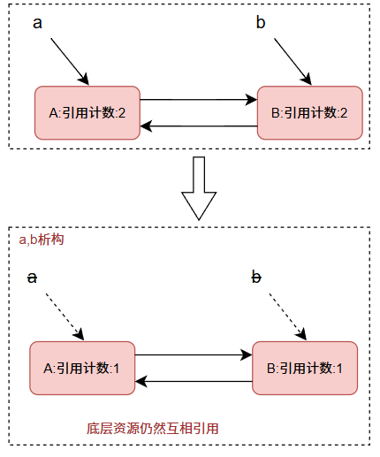

# 智能指针

## RAII和智能指针的设计思路

> RAII（Resource Acquisition Acquisition Is Initialization，资源获取即初始化）是 C++ 中管理资源（如内存、文件句柄、锁、网络连接等）的核心设计思想，其核心原则是： **将资源的生命周期与对象的生命周期绑定** —— 在对象构造时获取资源，在对象析构时自动释放资源，从而确保资源不会泄漏。

RAII核心思路主要聚焦于资源获取及资源释放,将资源获取与对象初始化进行绑定(如 `new`分配内存,`fopen`打开文件,`lock`加锁等),资源释放与对象析构绑定(如 `delete`释放内存,`fclose`关闭文件,`unlock`解锁等).

由于C++中,对象的声明周期由其作用域决定,离开作用域时自动调用析构函数.**因此,RAII对象离开作用域时,析构函数会自动执行,资源被可靠释放,无需手动操作.**

RAII解决了传统手动管理资源的缺陷,解决开发者遗忘释放的错误.在异常处理时,由于 `throw`语句可能会跳过后续的资源释放代码,RAII可以自动释放,保证了异常安全.

---

智能指针满足了RAII的设计思路,除了构造函数和析构函数,为了满足指针对于资源访问的作用,还需要运算符重载 `operator*(),operator->(),operator[]`等.下面是一个简单的智能指针实现.

```cpp
template<class T>
class SmartPtr {
public:
    // RAII
    SmartPtr(T* p) : _ptr(p)
    {
        cout << "new" << endl;
    }
    ~SmartPtr() 
    {
        cout << "delete" << endl;
        delete _ptr;
    }

    // 运算符重载, 提供指针操作接口
    T& operator*() const { return *_ptr; }
    T* operator->() const { return _ptr; }
private:
    T* _ptr;
};
```

下面验证智能指针在 `throw`异常后,能自动释放资源.

```cpp
void test_smart_ptr()
{
    cout << "\n----- 测试智能指针 -----\n";
    SmartPtr<int> a = new int(0);

    // 模拟异常
    throw std::runtime_error("模拟异常");
}

int main() {
    try {
        test_smart_ptr();
    }
    catch (const std::runtime_error& e) {
        cout << e.what() << endl;
    }
    return 0;
}


```

在 `test_smart_ptr`中,首先用智能指针指向新在堆中申请的空间,随后模拟异常,并没有显式写 `delete`,智能指针也不需要写.在 `main`中,调用 `test_smart_ptr`,捕捉异常.程序运行如下:

```bash
----- 测试智能指针 -----
new
delete
模拟异常
```

可以看到,虽然抛出异常,智能指针的析构函数仍会在栈展开时自动调用,将资源进行释放.

## 智能指针的使用及实现

> C++ 智能指针（Smart Pointers）是封装了原始指针的模板类，用于核心作用是 **自动管理动态内存** ，避免内存泄漏（忘记手动释放）和悬垂指针（访问已释放内存）等问题。C++11 及后续标准提供了三种常用智能指针：`std::unique_ptr`、`std::shared_ptr` 和 `std::weak_ptr`，均定义在 `<memory>` 头文件中。

`auto_ptr`是C++98时设计出来的智能指针，他的特点是拷贝时把被拷贝对象的资源的管理权转移给拷贝对象，这是一个非常糟糕的设计，因为他会到被拷贝对象悬空，访问报错的问题，C++11设计出新的智能指针后，强烈建议不要使用auto_ptr。其他C++11出来之前很多公司也是明令禁止使用这个智能指针的。

### unique_ptr:独占所有权的智能指针

`unique_ptr` 是**独占式**智能指针，同一时间内只能有一个 `unique_ptr` 指向同一对象，所有权不可共享。当 `unique_ptr` 销毁（如离开作用域）时，会自动释放所指向的内存。不需要指针拷贝的情况下推荐使用.

下面的代码可以看到,`unique_ptr`指向一个对象,其性能接近原始指针,无额外引用计数开销.

```cpp
int main() {
    // 创建 unique_ptr，指向 int 类型的动态内存（值为 10）
    unique_ptr<int> ptr1(new int(10));
    cout << *ptr1 << endl;   // 输出:10

    // 所有权转移（ptr1 不再拥有内存，变为空）
    unique_ptr<int> ptr2(move(ptr1));
    if (ptr1 == nullptr) {
        cout << "ptr1为空" << endl;
    }
    return 0;
}
```

```bash
10
ptr1为空
```

数组特化

`unique_ptr` 对数组有专门支持，会自动调用 `delete[]` 释放内存：

```cpp
    unique_ptr<int[]> arr(new int[3] {1, 2, 3});    // 指向数组
    cout << arr[0] << arr[1] << arr[2] << endl;     // 输出123
```

下面简单实现一下 `unique_str`.核心逻辑包括

1. 通过 `delete`禁止复制构造和赋值,确保所有权唯一.
2. 通过移动构造/赋值转移所有权,原对象指针置空.
3. 析构时自动 `delete`管理的指针,避免内存泄露.

```cpp
template<class T>
class MyUniquePtr {
private:
    T* _ptr;    // 管理的原始指针
public:
    // 构造函数：接管原始指针的所有权
    MyUniquePtr(T* ptr = nullptr) : _ptr(ptr) {}

    // 禁止拷贝构造(独占所有权,不能复制)
    MyUniquePtr<T>(const MyUniquePtr<T>&) = delete;

    // 禁止复制赋值
    MyUniquePtr<T>& operator=(const MyUniquePtr<T>&) = delete;

    // 允许移动构造(转移所有权),浅拷贝即可
    MyUniquePtr(MyUniquePtr<T>&& other) noexcept
        :_ptr(other._ptr)
    {
        other._ptr = nullptr;
    }

    // 允许移动赋值
    MyUniquePtr<T>& operator=(MyUniquePtr<T>&& other) noexcept
    {
        if (this != &other)
        {
            delete _ptr;        // 释放当前资源
            _ptr = other._ptr;  // 接管对方资源
            other._ptr = nullptr;// 对方放弃所有权
        }
        return *this;
    }

    // 析构函数:释放资源
    ~MyUniquePtr()
    {
        delete _ptr;
    }

    // 重载运算符
    T& operator*() const
    {
        return *_ptr;
    }

    T* operator->() const
    {
        return _ptr;
    }

    // 检查是否持有资源
    bool is_null() const
    {
        return _ptr == nullptr;
    }
};
```

下面一段代码对其进行测试,主要验证不可拷贝构造\赋值,以及对资源的独享.

```cpp
int main()
{
    MyUniquePtr<int> ptr1(new int(10));
    cout << *ptr1 << endl;  // 输出10

    //MyUniquePtr<int> ptr2(ptr1);    // 错误:禁止拷贝构造
    //MyUniquePtr<int> ptr2 = ptr1;   // 错误:禁止赋值

    MyUniquePtr<int> ptr2 = move(ptr1); // 移动赋值,转移资源
    cout << ptr1.is_null() << endl;     // 输出1,ptr1已空
    cout << *ptr2 << endl;              // 输出10

    return 0;
}
```

程序运行结果如下:

```bash
10
1
10
```

### shared_ptr:共享所有权的智能指针

`shared_ptr` 是**共享式**智能指针，允许多个 `shared_ptr` 指向同一对象，通过 **引用计数** （Reference Count）跟踪对象的所有者数量。当最后一个 `shared_ptr` 销毁时，对象才会被释放。

`shared_ptr`支持复制,每次复制会使引用计数加1;销毁时引用计数减1,计数为0时释放内存.

```cpp
int main()
{
    // 创建 shared_ptr, 引用计数初始为1
    shared_ptr<int> ptr1(new int(20));
    cout << "引用计数: " << ptr1.use_count() << endl;

    // 复制 ptr1, 引用计数变为2
    shared_ptr<int> ptr2 = ptr1;
    cout << "引用计数: " << ptr1.use_count() << endl;

    // 重置ptr1(不再指向对象),引用计数变为1
    ptr1.reset();
    cout << "引用计数: " << ptr2.use_count() << endl;

    return 0;
}
```

```bash
引用计数: 1
引用计数: 2
引用计数: 1
```

---

`shared_ptr`还支持 `make_shared`用初始化资源对象的值直接构造.

```cpp
template<class T, class... Args>
shared_ptr<T> make_shared(Args&& ...args)
```

`make_shared`是工厂函数(工厂函数是一种用于创建对象的函数,它根据输入参数生成特定类型的新数据项,常用于简化对象的创建过程),构建 `shared_ptr`时会一次分配指针指向对象内存以及引用计数内存,**减少内存碎片,提高效率**.下面是 `make_shared`的使用方式:

```cpp
struct Person {
    string _name;
    int _age;
    Person(string n, int a) : _name(n), _age(a) {}
};

int main()
{
    // 用make_shared创建shared_ptr
    auto ptr1 = make_shared<Person>("Tom", 20);
    // 传递new结果创造
    shared_ptr<Person> ptr2(new Person("Jerry", 20));
}
```

---

实现 `shared_ptr`,需要先思考,如何实现引用计数.不可以将计数器作为 `shared_ptr`的成员变量,否则每个 `shared_ptr`都会有一个独立的计数器,无法共享.也不可以使用 `static`成员变量,这样所有的 `shared_ptr`类都共用一个计数器,例如 `shared_ptr<int>`和 `shared_ptr<int[]>` 也共用一个计数器.

解决方法:要将计数器也存储在**堆空间**中,所有共享同一资源的 `shared_ptr`都持有指向该计数器的指针,为了封装性,可以把原始指针和计数器封装成一个类,`shared_ptr`拥有该类对象指针即可.

构造一个引用计数管理类,拥有原始指针和计数器,构造函数默认计数器为1,析构函数归还原始指针指向资源即可.

```cpp
// 引用计数管理类（单独管理计数，方便共享）
template<class T>
struct RefCount {
    T* _ptr;        // 指向管理的资源
    size_t _count;  // 强引用计数

    RefCount(T* p): _ptr(p), _count(1) {}
    ~RefCount() { delete _ptr; }
};
```

随后在 `MysharedPtr`中将 `RefCount<T>*` 作为成员变量,这样就能保证共享同一资源的 `MySharedPtr<T>`类对象拥有同一个计数器.

构造函数确保引用计数对象指向堆空间,只有原始指针不为空时引用计数才初始为1.

拷贝构造是浅拷贝,本质是多一个指针共享资源,并不需要将指针指向资源再拷贝一份.复制赋值也是同样.

复制赋值和析构函数由于都要先"释放一次"指向的资源(引用计数-1或直接释放),使其共用一个 `release`函数.

```cpp
// 简化版shared_ptr
template <class T>
class MySharedPtr {
private:
    RefCount<T>* _ref;   // 指向引用计数对象

public:
    // 构造函数:创建引用计数对象
    explicit MySharedPtr(T* p = nullptr)
    {
        if (p)
        {
            _ref = new RefCount<T>(p);
        }
        else
        {
            _ref = nullptr;
        }
    }

    // 拷贝构造:共享资源,计数+1(浅拷贝)
    MySharedPtr(const MySharedPtr<T>& other)
    {
        _ref = other._ref;
        if (_ref)
        {
            _ref->_count++;  // 计数增加
        }
    }

    // 计数-1，若为0则释放资源
    void release()
    {
        if (_ref && --_ref->_count == 0)
        {
            delete _ref;
            _ref = nullptr;
        }
    }

    // 复制赋值:先减当前计数(若为0则释放0),再共享新资源
    MySharedPtr& operator=(MySharedPtr<T>& other)
    {
        if (this != &other)
        {
            release();
            // 共享新资源
            _ref = other._ref;
            if (_ref)
            {
                _ref->_count++;
            }
        }
        return *this;
    }

    // 析构函数
    ~MySharedPtr()
    {
        release();
    }

    // 重载*和->
    T& operator*() const
    {
        return *_ref->_ptr;
    }

    T* operator->() const
    {
        return _ref->_ptr;
    }

    // 获取当前引用计数
    size_t use_count() const
    {
        return _ref ? _ref->_count : 0;
    }
};
```

随后进行测试,测试引用计数是否符合预期:

```cpp
int main()
{
    MySharedPtr<int> ptr1(new int(10));
    cout << "计数1: " << ptr1.use_count() << endl;

    MySharedPtr<int> ptr2 = ptr1;   // 复制构造,计数+1
    cout << "计数2: " << ptr1.use_count() << endl;

    {
        MySharedPtr<int> ptr3(ptr2);    // 拷贝构造,计数+1
        std::cout << "计数3：" << ptr3.use_count() << std::endl; // 输出：3
    }// ptr3 析构，计数-1 → 2

    std::cout << "计数4：" << ptr1.use_count() << std::endl; // 输出：2

    return 0;
}
```

```bash
计数1: 1
计数2: 2
计数3：3
计数4：2
```

### weak_ptr:解决shared_ptr循环引用

> `shared_ptr` 的**循环引用**是指两个或多个 `shared_ptr` 互相持有对方的引用，导致引用计数无法归零，最终引发资源泄漏。`weak_ptr` 是专门解决这一问题的弱引用智能指针，它不增加引用计数，可安全观察 `shared_ptr` 管理的资源。

当两个 `shared_ptr` 互相引用时,它们的引用计数会相互"锁定",即使离开作用域,由于计数无法减至0,导致资源永远不被释放.

下面代码中,`A`持有 `B`的 `shared_ptr`,`B`持有 `A`的 `shared_ptr`.创建 `a`和 `b`,此时各自计数为1,并且让其指向对方,此时计数为2.

离开作用域后,临时变量 `a`,`b`销毁,各自指向资源引用计数为1,指向资源并没有销毁,底层两个引用计数管理类仍然指向对方的资源,即使程序结束也销毁不了,`A`,`B`的析构函数不会被调用.

```cpp
struct B;   // 前置声明
struct A {
    shared_ptr<B> b_ptr;    // A 持有 B 的 shared_ptr
    ~A() { cout << "A 被销毁\n"; } // 不会被调用
};
struct B {
    shared_ptr<A> a_ptr;    // B 持有 A 的 shared_ptr
    ~B() { cout << "B 被销毁\n"; } // 不会被调用
};

int main()
{
    {
        shared_ptr<A> a(new A());   // a的计数=1
        shared_ptr<B> b(new B());   // b的计数=1

        a->b_ptr = b; // b 的计数变为 2（a->b_ptr 持有）
        b->a_ptr = a; // a 的计数变为 2（b->a_ptr 持有）
        cout << a.use_count() << endl;
        cout << b.use_count() << endl;
    }   // 离开作用域

    // 此时：
    // a 的计数从 2 减为 1（a 销毁），但 b->a_ptr 仍持有 a
    // b 的计数从 2 减为 1（b 销毁），但 a->b_ptr 仍持有 b
    // 最终计数都不为 0，A 和 B 的析构函数不执行 → 内存泄漏

    cout << "程序结束" << endl;
    return 0;
}
```



可以看到,`A`,`B`的析构函数并没有被调用,造成内存泄漏

```bash
2
2
程序结束
```

---

为了解决循环引用问题,引入 `weak_ptr`,`weak_ptr` 是一种 **弱引用** ,它指向 `shared_ptr` 管理的资源,但 **不增加引用计数** .

用 `weak_ptr`替代一方的 `shared_ptr`可以解决循环引用:

```cpp
struct B;  
struct A {
    shared_ptr<B> b_ptr;    // A 持有 B 的 shared_ptr
    ~A() { cout << "A 被销毁\n"; }
};
struct B {
    weak_ptr<A> a_ptr;    // B 持有 A 的 weak_ptr(不增加计数)
    ~B() { cout << "B 被销毁\n"; } 
};

int main()
{
    {
        shared_ptr<A> a(new A());   // a的计数=1
        shared_ptr<B> b(new B());   // b的计数=1

        a->b_ptr = b; // b 的计数变为 2
        b->a_ptr = a; // a 的计数仍为 1(weak_ptr不增加计数)
        cout << a.use_count() << endl;
        cout << b.use_count() << endl;
    }   // 离开作用域

    // 此时：
    // a 销毁 → 计数从 1 减为 0 → A 被析构 → a->b_ptr 销毁 → b 计数从 2 减为 1
    // b 销毁 → 计数从 1 减为 0 → B 被析构

    cout << "程序结束" << endl;
    return 0;
}
```

```bash
1
2
A 被销毁
B 被销毁
程序结束
```

---

`weak_ptr`的核心用法

1. 构造和赋值
   `weak_ptr` 只能从 `shared_ptr` 或另一个 `weak_ptr` 构造 / 赋值，不能直接管理原始指针：

   ```cpp
       shared_ptr<int> sp(new int(10));
       weak_ptr<int> wp1(sp);      // 从 shared_ptr 构造
       weak_ptr<int> wp2 = wp1;    // 从 weak_ptr 赋值
   ```
2. 获取有效 `shared_ptr`（`lock()` 方法）
   `weak_ptr` 本身不能直接访问资源，需通过 `lock()` 方法获取 `shared_ptr`（若资源已释放，返回空 `shared_ptr`）

   ```cpp
      std::shared_ptr<int> sp2 = wp1.lock();
      if (sp2) { // 检查资源是否有效
          std::cout << *sp2 << std::endl;
          cout << sp2.use_count() << endl;
      }
      else {
          std::cout << "资源已释放\n";
      }
      return 0;
   ```

   ```bash
   10
   2
   ```
3. 检查资源是否存在（`expired()`方法）
   `expired()` 返回 `bool`，表示资源是否已被释放（等价于 `use_count() == 0`）：

   ```cpp
   if (wp.expired()) {
   std::cout << "资源已释放\n";
   }
   ```

要注意的是:`weak_ptr`没有重载 `operator*`和 `operator->`等,因为他不参与资源管理,那么如果他绑定的
`shared_ptr`已经释放了资源,那么他去访问资源就是很危险的.

## 智能指针的删除器

> 智能指针的**删除器（Deleter）** 是一个可调用对象（函数、Lambda、函数对象等），用于定义智能指针管理的资源的 **释放逻辑** 。默认情况下，智能指针使用 `delete` 释放资源，但对于特殊资源（如数组、文件句柄、互斥锁等），需要自定义删除器来确保资源被正确释放。

C++智能指针(`unique_ptr`/`shared_ptr`)默认假设资源是通过 `new`分配的,因此用 `delete`释放.但实际开发中,资源可能通过其他方式分配,需要特殊释放逻辑.

- 数组:需用 `delete[]`
- 动态内存:用 `malloc`分配的内存需用 `free`释放
- 系统资源:文件句柄 `fclose`,互斥锁 `phread_mutex_unlock`等

### unique_ptr的删除器

`unique_ptr`的删除器是其模板参数的一部分

```cpp
std::unique_ptr<T, Deleter> ptr;
```

下面是释放数组的代码:

```cpp
int main()
{
    // 自定义删除器:用delete[]释放数组
    auto arr_deleter = [](int* p) {
        cout << "释放数组" << endl;
        delete[] p;
    };

    // unique_ptr 绑定删除器（模板参数需指定删除器类型）
    unique_ptr<int, decltype(arr_deleter)> arr_ptr(new int[3] {1, 2, 3}, arr_deleter);

    return 0; // 离开作用域时，自动调用 arr_deleter 释放数组
}
```

---

### shared_ptr的删除器

`shared_ptr` 的删除器不是模板参数，而是在构造时传入的

```cpp
std::shared_ptr<T> ptr(new T(), deleter);
```

下面是释放文件句柄的代码:

```cpp
// 自定义删除器:关闭文件 通过仿函数实现
class Fclose
{
public:
    void operator()(FILE* ptr)
    {
        cout << "fclose:" << ptr << endl;
        fclose(ptr);
    }
};

int main()
{
    // 打开文件
    FILE* fp = fopen("test.txt", "w+");
    if (!fp)
    {
        return 1;
    }

    // shared_ptr 管理文件句柄，绑定删除器
    shared_ptr<FILE> file_ptr(fp, Fclose());

    return 0; // 自动调用 file_deleter 关闭文件
}
```

### 删除器的实现

由于 `unique_ptr`和 `shared_ptr`的删除器一个是模板参数,一个是构造时传入.这里只是简单实现构造时传入的方式.

需要添加成员变量,类型为 `std::function<void(T*)>`以方便函数包装,在构造的时候传入删除器即可.

为了方便默认普通 `delete`的智能指针创建,重载一份有删除器版本的构造函数即可.析构函数统一调用删除器进行资源释放.

方便代码展示,其他拷贝构造,赋值构造,运算符重载未在代码中展示.

```cpp
template<class T>
class SmartPtr {
private:
    T* _ptr;
    std::function<void(T*)> _del = [](T* p) {delete p; };    // 默认为普通delete
public:
    // 默认构造函数
    SmartPtr(T* ptr = nullptr)
        :_ptr(ptr)
    { }

    // 带删除器的构造函数
    template<class Deleter>
    SmartPtr(T* ptr, Deleter del)
        : _ptr(ptr), _del(move(del))
    { }

    // ...

    // 析构函数
    ~SmartPtr()
    {
        _del(_ptr); // 调用删除器进行释放资源
        cout << "释放资源" << endl;
        _ptr = nullptr;
    }
};

int main()
{
    SmartPtr<int> ptri(new int(10));
    auto arr_deleter = [](int* arr) {
        delete[] arr;
        cout << "释放数组" << endl;
    };
    SmartPtr<int> ptrarr(new int[3] {1, 2, 3}, arr_deleter);

    return 0;
}
```

可以看到,资源释放了两次,数组也通过传入指定删除器来构造指针成功释放

```bash
释放数组
释放资源
释放资源
```
