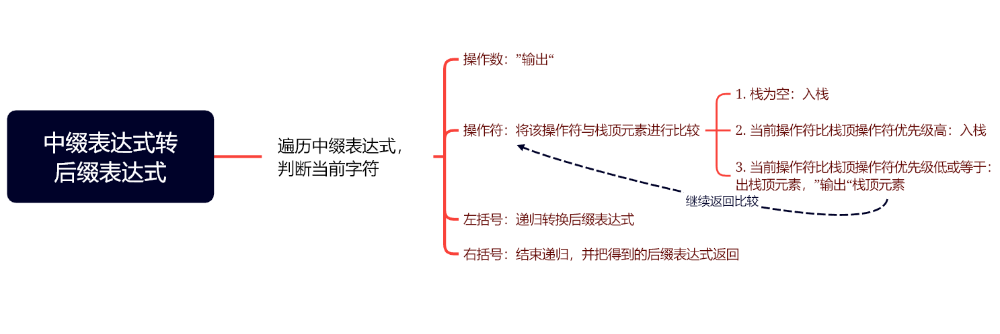

# 栈的应用-四则运算表达式求值

## 1. 后缀（逆波兰）表示法

我们平时写的数学计算表达式是中缀表达式，表示**左操作数+操作符+右操作数**，形如` a + b * c`的就叫做中缀表达式。

但是计算机对于计算中缀表达式却有困难，计算机先依次将 `a` 、`+`、 `b` 放入栈中，这个时候应该计算吗？如果计算了，很明显答案是错误的，因为后面还有乘法`*`, 乘法的优先级是要比加法高的。如果碰到有括号的表达式，如`(a + b) * (c - d) ` , 就更为复杂了。

对此，一种**不需要括号，适应栈结构的表达式**--**后缀表达式**可以解决计算机计算的困难。

| 中缀表达式  | 后缀表达式 |
| :---------: | :--------: |
| `a + b + c` |  `ab+c+`   |
| `a + b * c` |  `abc*+`   |

后缀表达式的表示方法：**运算数顺序不变，运算符按优先级进行排布**

## 2. 后缀（逆波兰）表达式计算

【题目链接】：[LCR 036. 逆波兰表达式求值](https://leetcode.cn/problems/8Zf90G/)

思路：要用到一个栈空间，用于存放运算数


代码实现：

```c++
class Solution {
public:
    int evalRPN(vector<string>& tokens) {
      stack<int> st;
      for (auto &e : tokens)
      {
        if (e == "+" || e == "-" || e == "*" || e == "/")
        {
          // 如果e是操作符，出两次栈，进行计算
          int b = st.top();
          st.pop();
          int a = st.top();
          st.pop();
          switch(e[0])
          {
            case '+':
              st.push(a + b); break;
            case '-':
              st.push(a - b); break;
            case '*':
              st.push(a * b); break;
            case '/':
              st.push(a / b); break;
          }
        }
        else
        {
          // 如果e是操作数，入栈
          st.push(std::stoi(e.c_str()));
        }
      }
      return st.top();
    }
};
```

## 3. 中缀表达式转换成后缀表达式

后缀表达式与中缀表达式的区别就是运算符的位置，转换需要调整运算符优先级

思路：



---

例如：`a + b * (c - d / e) + f`

重点是**若字符是操作符或者括号时候的处理**

- 操作数`a`直接输出。接着`+`，此时栈空，`+`入栈。


- 操作数`b`直接输出。接着`*`, `*`优先级比`+`要高，`*`入栈。


- 左括号递归进行转换后缀表达式，建立一个新的栈空间。栈空，`-`入栈


- 操作数`d`直接输出。`/`优先级比`-`高，入栈。


- 操作数`e`直接输出。遇到`)`,将栈内所有运算符依次出栈，得到结果


- 该结果接到递归的上一层结果后


- `+`号比栈顶元素`*`优先级低，`*`出栈输出。`+`继续与栈顶元素`+`进行比较，相等仍然需要栈顶元素出栈输出。


- 操作数`f`直接输出。遍历到中缀表达式结尾，栈内元素依次出栈输出。


最后得到结果：`a + b * (c - d / e) + f`-->`a b c d e / - * f +`

---
