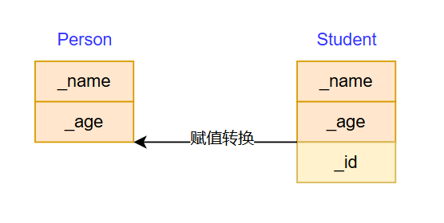

# 一.继承的概念及定义

> **继承**机制是面向对象程序设计**使代码可以复用**的最重要的手段，可以在**维持原有基类特性的基础上进行扩展**，增加功能，产生的新的类称为**派生类**。

```cpp
// 基类 Person
class Person 
{
public:
 void Print()
 {
  cout << _name << endl;
  cout << _age << endl;
 }
protected:
 string _name = "张三";
 int _age = 20;
};

// 派生类 Student
class Student : public Person
{
protected:
 int _id = 0000;
};

int main()
{ 
 Person p;
 Student s;

 return 0;
}
```

可以看到，创建的`Student`类的对象`s`,即使其表面只有一个成员，但是还继承了其父类`Person`的两个成员。

之前学过访问限定符`private`、`protected`和`public`，同样的，继承方式也是这三种；在这里，派生类是基类的`public`继承

下面的表格总结了不同继承方式基类的成员访问情况

| 类成员/继承方式 | public继承 |protected继承| private继承
| :---------: | :--------: | :--------: | :--------: |
|**基类的public成员**|  派生类的public成员| 派生类的protected成员 | 派生类的private成员|
| **基类的protected成员** | 派生类的protected成员| 派生类的protected成员| 在派生类中不可见 |
| **基类的private成员** | 在派生类中不可见 | 在派生类中不可见 | 在派生类中不可见|

总之，继承方式决定了派生类访问的下限，基类本身成员的访问限定决定了派生类能访问的上限。
日常多使用`public`继承。

# 二.基类和派生类对象赋值转换
>
> 赋值转换又叫切片或切割

之前学过凡是进行类型转换，都会产生具有**常性的临时变量**。

```cpp
int a = 10;
double b = a;
double &c = a;
const double & d = a;
```

第二行代码会默认生成一个具有常性的`double`型的10，随后赋值给`b`。
这就是为什么第三行代码编译器会直接报错，只有写成第四行才行:常量只能进行`const`引用

但是对于基类和派生类之间的赋值，有特别规定：

1. 只能**派生类的对象赋值给基类的对象/指针/引用**，这就是赋值兼容转换，也叫切片或者切割。
2. 基类的对象**不可以**赋值给派生类的对象。
3. 基类的指针或者引用可以通过强制类型转换赋值给派生类的指针或者引用。但是必须是基类
的指针是指向派生类对象时才是安全的。（这个涉及多态内容，后面再说）



```cpp
Person p;
Student s;

// 派生类对象可以切片/赋值转换给基类对象、指针及引用，中间不会默认生成常量
Person p1 = s;
Person* p2 = &s;
Person& p3 = s;

// 基类对象不可以赋值给派生类对象
// Student s1 = p;  // ERROR
```

# 三. 继承中的作用域

在继承体系中，**基类和派生类拥有独立的作用域**，这就代表着基类和派生类可以有同名成员。

这里，引入**隐藏**的语法规则：若派生类和基类拥有同名成员，派生类会**隐藏**基类的同名成员，**隐藏也叫重定义**。
所以，如果打印派生类对象的`_name`,会出现以下情况
