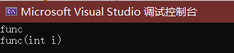

# 一.继承

## 继承的概念及定义

> **继承**机制是面向对象程序设计**使代码可以复用**的最重要的手段，可以在**维持原有基类特性的基础上进行扩展**，增加功能，产生的新的类称为**派生类**。

```cpp
// 基类 Person
class Person 
{
public:
    void Print()
    {
        cout << _name << endl;
        cout << _age << endl;
    }
protected:
    string _name = "张三";
    int _age = 20;
};

// 派生类 Student
class Student : public Person
{
protected:
    int _id = 0000;
};

int main()
{ 
    Person p;
    Student s;

    return 0;
}
```

可以看到，创建的`Student`类的对象`s`,即使其表面只有一个成员，但是还继承了其父类`Person`的两个成员。

之前学过访问限定符`private`、`protected`和`public`，同样的，继承方式也是这三种；在这里，派生类是基类的`public`继承

下面的表格总结了不同继承方式基类的成员访问情况

| 类成员/继承方式 | public继承 |protected继承| private继承
| :---------: | :--------: | :--------: | :--------: |
|**基类的public成员**|  派生类的public成员| 派生类的protected成员 | 派生类的private成员|
| **基类的protected成员** | 派生类的protected成员| 派生类的protected成员| 在派生类中不可见 |
| **基类的private成员** | 在派生类中不可见 | 在派生类中不可见 | 在派生类中不可见|

总之，继承方式决定了派生类访问的下限，基类本身成员的访问限定决定了派生类能访问的上限。
日常多使用`public`继承。

## 基类和派生类对象赋值转换
>
> 赋值转换又叫切片或切割

之前学过，凡是进行类型转换，都会产生具有**常性的临时变量**。

```cpp
int a = 10;
double b = a;
double &c = a;  ❌
const double & d = a;
```

第二行代码会默认生成一个具有常性的`double`型的10，随后赋值给`b`。
这就是为什么第三行代码编译器会直接报错，只有写成第四行才行:常量只能进行`const`引用

但是对于基类和派生类之间的赋值，有特别规定：

1. 只能**派生类的对象赋值给基类的对象/指针/引用**，这就是赋值兼容转换，也叫切片或者切割。
2. 基类的对象**不可以**赋值给派生类的对象。
3. 基类的指针或者引用可以通过强制类型转换赋值给派生类的指针或者引用。但是必须是基类
的指针是指向派生类对象时才是安全的。（这个涉及多态内容，后面再说）


```cpp
Person p;
Student s;

// 派生类对象可以切片/赋值转换给基类对象、指针及引用，中间不会默认生成常量
Person p1 = s;
Person* p2 = &s;
Person& p3 = s;

// 基类对象不可以赋值给派生类对象
// Student s1 = p;  ❌
```

## 继承中的作用域

> 在继承体系中，**基类和派生类拥有独立的作用域**，如果基类和派生类有同名成员，此时派生类会屏蔽对基类同名成员的直接访问，这种情况叫**隐藏**（也叫做重定义）。

如果想要访问，可以按照下面的格式进行显示访问

```
基类：：基类成员
```

下面演示基类和派生类拥有同名成员的场景：

```cpp

// 基类 Person
class Person 
{
protected:
    string _name = "张三";
    int _age = 20;
};

// 派生类 Student
class Student : public Person
{
public:
    void Print()
    {
        cout << _name << endl;
        cout << _age << endl;
        cout << _id << endl;
    }
protected:
    int _id = 0000;
    string _name = "李四";
};

int main()
{
    Student s;
    s.Print();

    return 0;
}
```

派生类和基类都有`_name`成员，由于**隐藏**，派生类对象默认会访问自己的同名成员。


思考以下代码中`A::func`和`B::func`构成什么关系？

```cpp
class A {
public:
    void func() 
    {
        cout << "func" << endl;
    }
};

class B :public A{
public:
    void func(int i)
    {
        A::func();
        cout << "func(int i)" << endl;
    }
};

int main()
{
    B b;
    // b.func();   ❌ 函数调用的参数过少
    b.func(10);

    return 0;
}   
```

运行结果如下：

分析：由于基类和派生类所属不同作用域，而重载关系的前提是在同一作用域中，所以**不能是重载关系**。其实两者构成**隐藏**关系，派生类对象`b`不可以直接调用基类中的`func()`成员函数，却可以通过添加限定符显示调用`func()`成员函数。

**由此，要注意**：

1. 成员函数只要同名就会发生隐藏，与返回值和参数无关。
2. 在实际**继承体系**中尽量避免同名成员的情况。

## 继承和友元

> 友元关系不可以继承，也就是说基类的友元函数派生类不可以直接使用，只有在派生类也添加友元声明才可。

## 继承和静态成员
>
> **基类定义了静态成员，则整个继承体系只有这一个静态成员**，无论派生出多少个类，都只有一个`static`实例。

静态成员是在静态区存放的，可以理解为基类和派生类共享一个静态成员。

下面的代码可以增加理解：

```cpp
class A {
public:
    A(){ _cnt++;}
public:
    static int _cnt;
};

int A::_cnt = 0;

class B : public A {
protected:
    int _num;
};

int main()
{
    A a1, a2, a3;
    B b1;

    cout << "静态成员该继承体系下只有一份:" << endl;
    cout << a1._cnt << endl;
    cout << a2._cnt << endl;
    cout << b1._cnt << endl;

    cout << "一旦被修改，其他对象进行访问的数据也是被修改后的同一数据:" << endl;
    a3._cnt = 0;
    cout << a1._cnt << endl;
    cout << b1._cnt << endl;

    cout << "根据地址可以再次验证，该继承体系下实际就只有一份静态成员：" << endl;
    cout << &a1._cnt << endl;
    cout << &a2._cnt << endl;
    cout << &b1._cnt << endl;
}
```

结果如下：


# 二.派生类的默认成员函数

我们都知道，类的默认成员函数有六种
/1698668002124.png)
在这里，重点关注**构造函数、析构函数、拷贝构造、赋值重载**，宗旨为<font color = red>将基类和派生类的成员分别处理</font>。


## 构造函数
>
> 派生类的构造函数，对于**基类的那部分成员**，必须调用**基类的构造函数**进行初始化，如果基类没有默认的构造函数，则需要在派生类的初始化列表阶段进行**显式调用**。

这里创建了**基类**`Person`和**派生类**`Student`，基类有其默认的构造函数，下面分别针对派生类的三个构造函数进行分析

```cpp
class Person {
public:
    Person(string name = "张三", int age = 20)
        :_name(name)
        ,_age(age)
    {
        cout << "Person()" << endl;
    }
protected:
    string _name;
    int _age;
};

class Student : public Person {
public:
    Student(int sid = 1001) // 构造函数1
        :_sid(sid)
    {
        cout << "Student(sid)" << endl;
    }
    
    Student(string name, int age, int sid)  // 构造函数2
        :Person(name, age)  // 语法要求如此格式
        , _sid(sid)
    {
        cout << "Student(name,age,sid)" << endl;
    }

    //❌ 派生类不可直接处理基类的成员
    //Student(string name, int age, int sid)  // 构造函数3
    //    :_name(name)
    //    ,_age(age)
    //    , _sid(sid)
    //{
    //    cout << "Student(name,age,sid)" << endl;
    //}
protected:
    int _sid;
};

int main()
{   
    Student s1;
    Student s2("李四", 21, 1001);
}
```

运行结果如下：


对于`Student s1`，即使没有显示调用基类的构造函数，实际上也是先调用了基类默认构造函数，接着调用了派生类构造函数1；
对于`Student s2("李四", 21, 1001)`，首先调用了基类构造函数，接着调用了派生类构造函数2；
对于派生类构造函数3，编译器直接报错，派生类中不可以直接处理基类的成员。

同时，可以发现：
> 派生类对象初始化先调用基类构造再调派生类构造。

## 拷贝构造函数

拷贝构造也是同样的规则
> 派生类的拷贝构造函数必须调用基类的拷贝构造完成基类的拷贝初始化。

在上面基类派生类的基础上，添加如下拷贝构造函数

```cpp
Person(const Person& p)
    :_name(p._name)
    ,_age(p._age)
{
    cout << "Person(const Person& p)" << endl;
}
```

```cpp
Student(const Student& s)
    :Person(s)      // 派生类必须调用基类的拷贝构造
    , _sid(s._sid)
{
    cout << "Student(const Student& s)" << endl;
}
```

同时在`main`函数中执行`Student s3(s2);`，得到结果如下：


需要注意：<font color = red>派生类中调用基类的拷贝构造时，用到了赋值转换</font> ，将`s`切片赋值给传入基类拷贝构造函数的参数`p`。

## 赋值重载

> 派生类的`operator=`必须要调用基类的`operator=`完成基类的复制。

```cpp
Person& operator=(const Person& p)
{
    cout << "Person& operator=(const Person& p)" << endl;
    if (this != &p)
    {
        _name = p._name;
        _age = p._age;
    }
    return *this;
}
```

```cpp
Student& operator=(const Student& s)
{
    cout << "Student& operator=(const Student& s)" << endl;
    if (this != &s) 
    {
        Person::operator=(s);   // 显式调用基类赋值重载
        _sid = s._sid;
    }
    return *this;
}
```

`Student s4 = s1;`结果如下：


由于派生类会**隐藏**基类的同名成员函数，并且两者**赋值重载函数名相同**，需要**显式调用基类赋值重载**，否则会出现无限递归的情况。

## 析构函数

不同于构造、拷贝构造和赋值重载，为了安全性，需要先析构派生类成员，再析构基类成员。
由于构造派生类时已经存在基类成员，假设（实际不推荐这样设计）*派生类成员引用了基类成员*；或者*派生类指针成员指向了基类成员*，若先进行基类析构则可能会有野指针或其他安全性问题。所以为了确保绝对安全：
> 派生类对象析构清理先调用派生类析构再调基类的析构。

但是只要在派生类析构内**显式调用**基类析构，就必然会出现先基类后派生类的情况:

```cpp
~Person()
{
    cout << "~Person()" << endl;
}
```

```cpp
~Student()
{
    Person::~Person();
    cout << "~Student()" << endl;
}
```

但是却发现结果出现了两次对基类的析构，而代码只显式调用基类析构一次。


这是由于
> 派生类的析构函数会在被调用完成后**自动调用**基类的析构函数清理基类成员。因为这样才能保证派生类对象先清理派生类成员再清理基类成员的顺序。

将显式调用注释掉即可得到想要的结果：


其实因为后续一些场景析构函数需要构成重写，编译器对析构函数名进行了特殊处理，处理成`destructor()`，派生类析构函数和基类析构函数构成**隐藏**关系。

# 三.多继承和菱形继承问题

## 多继承概念

单继承：一个子类只有一个直接父类时的继承关系

多继承：一个子类有两个或以上直接父类时的继承关系

有了多继承就可能会出现**菱形继承**，菱形继承是有其**问题**的，例如下图：


## 菱形继承的问题
>
> 菱形继承的问题：菱形继承会出现**数据冗余**和**二义性**的问题。


首先谈一下二义性的问题：

```cpp
class Person {
public:
    string _name;   // 姓名
};

class Student : public Person {
protected:
    int _num;   // 学号
};

class Teacher : public Person {
protected:
    int _id;    // 职工编号
};

class Assistant : public Student, public Teacher {
public:
    string _majorCourse;    // 主修课程
};

int main()
{
    Assistant a;
    // a._name = "Peter";  ❌二义性，Assistant::_name 不明确

    // 需要显式指定访问哪个父类的成员可以解决二义性问题
    a.Student::_name = "xxx";
    a.Teacher::_name = "yyy";
}
```


观察到虽然通过显式指定访问可以解决**二义性**的问题，但是仍然存在**数据冗余**：`a`中仍然存在两份`_name`，如果只考虑正式名字的话，只应该出现一份`_name`。

## 虚拟继承解决菱形继承问题
>
> 虚拟继承可以解决菱形继承的二义性和数据冗余的问题。

在**类腰部**添加`virtual`关键字即可，其他地方不变。

```cpp
class Person {
public:
    string _name;   // 姓名
};

// 虚拟继承
class Student : virtual public Person {
protected:
    int _num;   // 学号
};

// 虚拟继承
class Teacher : virtual public Person {
protected:
    int _id;    // 职工编号
};

class Assistant : public Student, public Teacher {
public:
    string _majorCourse;    // 主修课程
};
```

这时，可以直接进行对`Assistant::_name`的操作，显示访问也不会受影响，这样就解决了**数据冗余**和**二义性**的问题

```cpp
Assistant a;
a._name = "Peter"; 
a.Student::_name = "xxx";
a.Teacher::_name = "yyy";
```

可以看到，数据冗余的问题被解决了：


## 虚拟继承底层分析

为了研究虚拟继承原理，我们给出了一个简化的菱形继承继承体系，再借助**内存窗口**观察对象成员的模型


```cpp
class A{
public:
    int _a;
};

class B :virtual public A {
public:
    int _b;
};

class C :virtual public A {
public:
    int _c;
};

class D :public B, public C {
public :
    int _d;
};

int main()
{
    D d;
    d.B::_a = 1;
    d.C::_a = 2;
    d._b = 3;
    d._c = 4;
    d._d = 5;
    return 0;
}
```


通过调试调用内存监视发现，`D`中的`A`被放在了最底部，这个`A`也是`B`和`C`中的，那么怎么能找到呢？
**这里是通过了`B`和`C`的两个指针，指向的一张表。这两个指针叫虚基表指针，这两个表叫虚基表。虚基表中存的偏移量。通过偏移量可以找到下面的`A`。**
由于电脑是小端存储，将`B`首地址`0x00CFFA28`加上原来`A`位置上指针指向的一块空间的值`0x00000014`等于`0xCFFAFA4c`；同理，将`C`首地址`0x00CFFA30`加上`0x0000000c`也等于`0xCFFAFA4c`。
而`0xCFFAFA4c`对应恰好是`A`的空间，由此可以知道虚拟继承中的公共字段是怎么找的了。

下面是上面的`Person`关系菱形虚拟继承的原理解释：


这样设计可以保证任何情况下都可以找到公共的`A`

```cpp
B *pb = d;  // pb指向D中B的切片
pb->_a++;    // B中实际没有存_a, 根据偏移量可以找到_a

pb = &b;
pb->_a++;   // 即使不是切片，B中内存模型也是上图那样
```

多继承很复杂，尤其是可能会造成菱形继承。一般不要设计多继承，一定不要设计菱形继承，否则在复杂度和性能上都会有问题。

## 继承和组合
>
> - `public`是一种**is-a**的关系。每个派生类对象都是一个基类对象。
> - 组合是一种**has-a**的关系。假设B组合了A，那么每个B对象中都有一个A对象。
> - 优先使用对象组合，而不是类继承 。
> - 继承允许你根据基类的实现来定义派生类的实现。这种通过生成派生类的复用通常被称为白箱复用(white-box reuse)。术语“白箱”是相对可视性而言：在继承方式中，基类的内部细节对子类可见 。继承一定程度破坏了基类的封装，基类的改变，对派生类有很大的影响。派生类和基类间的依赖关系很强，耦合度高。
> - 对象组合是类继承之外的另一种复用选择。新的更复杂的功能可以通过组装或组合对象来获得。对象组合要求被组合的对象具有良好定义的接口。这种复用风格被称为黑箱复用(black-box reuse)，因为对象的内部细节是不可见的。对象只以“黑箱”的形式出现。组合类之间没有很强的依赖关系，耦合度低。优先使用对象组合有助于你保持每个类被封装。
> - 实际尽量多去用组合。组合的**耦合度低**，代码维护性好。不过继承也有用武之地的，有些关系就适合继承那就用继承，另外要实现**多态**，也必须要继承。类之间的关系可以用继承，可以用组合，就用组合。
